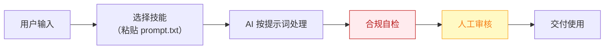

# 探店编导 — 业务架构

## 四层视图

```mermaid
flowchart TD
    subgraph L1["① 用户层"]
        U["无内容团队的餐饮/美业/健身门店老板（71% 无专业内容团队，据 R4 调研）"]
    end

    subgraph L2["② 数字员工层"]
        E["探店编导<br/>门店的"编外内容总监"：每天给出拍什么、怎么拍、怎么挂团购的完整答案"]
    end

    subgraph L3["③ 工作流层（5 条）"]
        W1["每日热点选题"]
        WN["…共 5 条"]
    end

    subgraph L4["④ 原子技能层（5 个）"]
        SK1["短视频脚本生成"]
        SK2["本地热点追踪"]
        SK3["团购挂载文案"]
        SK4["多平台规格适配"]
        SK5["AIGC 标识合规"]
    end

    U -->|"提出需求"| E
    E -->|"编排调用"| W1
    W1 --> WN
    W1 --> SK1

    style L1 fill:#E8F4FD,stroke:#1976D2,color:#0D47A1
    style L2 fill:#FFF3E0,stroke:#E65100,color:#BF360C
    style L3 fill:#F3E5F5,stroke:#7B1FA2,color:#4A148C
    style L4 fill:#E8F5E9,stroke:#388E3C,color:#1B5E20
```

## 资产形态说明

本资产包为**纯提示词客户端资产**：

| 特性 | 说明 |
|------|------|
| 无运行时依赖 | 不调用任何模型 API，不需要 API Key |
| 平台无关 | 提示词为纯文本，可导入任意主流 AI 平台 |
| 用户自备算力 | 模型由用户自己的订阅提供 |
| 零服务端成本 | 资产方不产生任何调用费用 |

## 数据流



> **关键设计**：所有对外输出必须经过「合规自检 → 人工审核」双闸门。

## 能力边界

| 维度 | 内容 |
|------|------|
| **目标用户** | 无内容团队的餐饮/美业/健身门店老板（71% 无专业内容团队，据 R4 调研） |
| **做** | **做**：选题策划、脚本与口播文案、分镜建议、封面标题、发布排期、团购挂载建议；** |
| **不做** | 不做**：不代发（发布动作留给老板一键完成）、不承诺播放量、 |
| **KPI** | 周产出可用脚本 ≥5 条；老板单条素材加工耗时 ≤20 分钟；内容更新频率 ≥3 条/周 |
| **定价** | 300–2000 元/月（本地商家愿为 AI 批量内容付 500–2000 元/月，据 R4 调研）；**代配置服务加成：500–1500 元/次**（卖点库灌入+账号授权代办+首周陪跑，可占总成交额的 30–50%，本群体付费意愿最强的增值服务） |

---

*本图由 build_p0_assets.py 自动生成*
