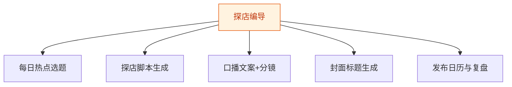

# 探店编导 — 工作流流程图

本员工共 **5 条工作流**，下辖 **5 个原子技能**。

## 总览

## 分条详情

### 每日热点选题

| 项目 | 内容 |
|------|------|
| 触发 | 定时（每日 7:00） |
| 复杂度 | `S` |
| 阶段 | `P0` |
| ROI | 替代老板刷热点 30 分钟/天 ≈ 月省 15 小时 |

### 探店脚本生成

| 项目 | 内容 |
|------|------|
| 触发 | 人工（老板投喂素材照片/语音描述） |
| 复杂度 | `S` |
| 阶段 | `P0` |
| ROI | 外包单条脚本 200–500 元，月产 15 条 ≈ 省 3000 元+ |

### 口播文案+分镜

| 项目 | 内容 |
|------|------|
| 触发 | 人工（随 W2 联动） |
| 复杂度 | `S` |
| 阶段 | `P0` |
| ROI | 同上，打包计入 |

### 封面标题生成

| 项目 | 内容 |
|------|------|
| 触发 | 人工 |
| 复杂度 | `S` |
| 阶段 | `P0` |
| ROI | 每条省 15 分钟纠结时间 |

### 发布日历与复盘

| 项目 | 内容 |
|------|------|
| 触发 | 定时（每周一） |
| 复杂度 | `M` |
| 阶段 | `P1` |
| ROI | 解决"不知道发什么"的持续枯竭问题 |

## 汇总表

| # | 工作流 | 阶段 | 复杂度 | 触发 | 涉及技能数 |
|---|--------|------|--------|------|-----------|
| 1 | 每日热点选题 | `P0` | `S` | 定时（每日 7:00） | 1 |
| 2 | 探店脚本生成 | `P0` | `S` | 人工（老板投喂素材照片/语音描述） | 1 |
| 3 | 口播文案+分镜 | `P0` | `S` | 人工（随 W2 联动） | 1 |
| 4 | 封面标题生成 | `P0` | `S` | 人工 | 1 |
| 5 | 发布日历与复盘 | `P1` | `M` | 定时（每周一） | 1 |

---

*本图由 build_p0_assets.py 自动生成*
