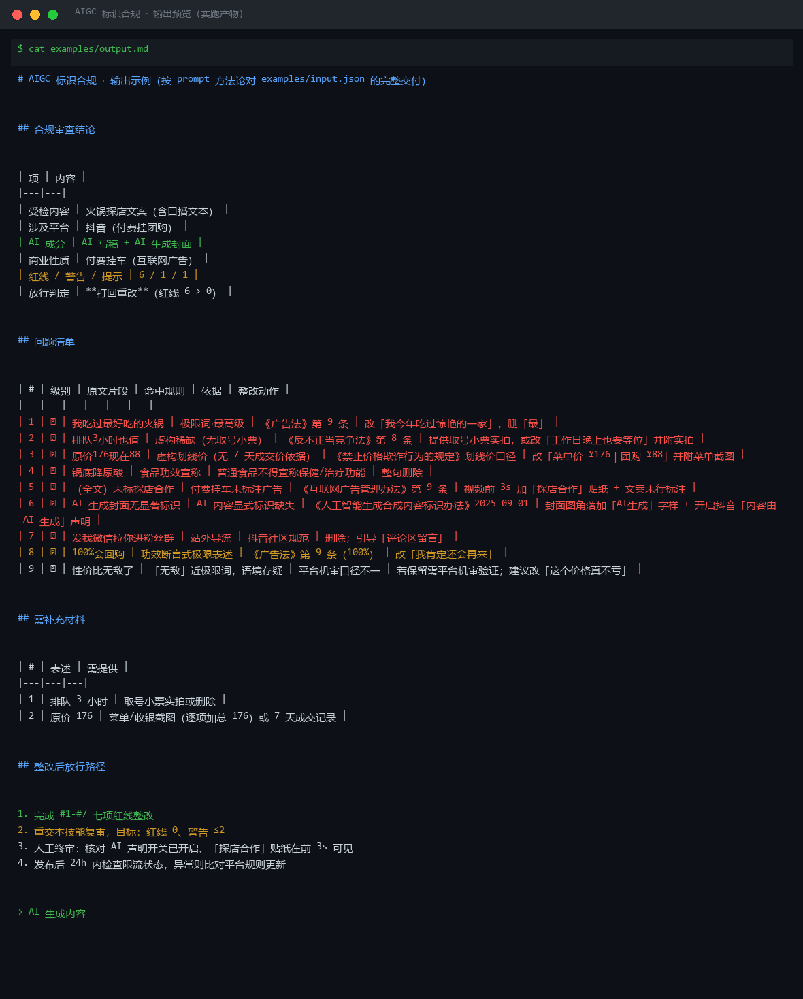
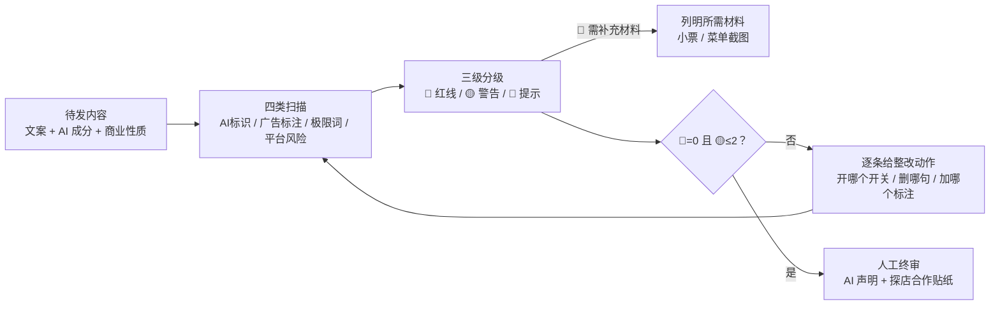

# AIGC 标识合规 AIGC Label Compliance

> 原子技能 ｜ 属于「探店编导」 ｜ 本地生活商家客群 ｜ T2 提示词型
>
> **发布前把会招来限流、下架、市监处罚的问题挑出来：AI 标识缺失、广告标注缺失、极限词、虚构信息四类，给出可执行的整改动作。**
> 4 类检查 · 挂靠 6 部法规条款 · AI 标识 4 项逐项核对 · 放行标准 🔴=0 且 🟡≤2 · 拿不准 AI 成分不放行



🎬 **[▶ 观看演示视频（在线播放）](https://cdn.jsdelivr.net/gh/bangwozuo/local-content-zh@main/skills/aigc-label-compliance/docs/assets/demo.mp4) · [GitHub 页](https://github.com/bangwozuo/local-content-zh/blob/main/skills/aigc-label-compliance/docs/assets/demo.mp4)** — 四幕检测叙事：业务钩子 → 真实执行 → 检查项逐条亮灯 → 交付物

*上图是本技能对 `examples/input.json` 的实跑交付（`examples/output.md`）：96 字探店文案查出 9 项问题（红线 6 / 警告 1 / 提示 1），判定「打回重改」，并给出整改后放行路径 4 步。*

---

## 它查什么（四类，逐类过，命中必须引用原文片段）

### 一类：AI 标识（逐项核对，缺一即 🔴）

1. 文案/成片是否含 AI 成分（AI 写稿、AI 配音、AI 生成封面都算）
2. 视频是否开启平台 AI 声明（抖音「内容由 AI 生成」/ 小红书 AIGC 声明）
3. AI 生成封面是否有**画面内**显著标识（仅元数据标识不算合规）
4. AI 配音口播是否有声音合成提示

**判定口径**：完全人拍人写 → 不需要标识；AI 参与 → 必须显式标识。拿不准 AI 成分比例时按「有 AI 参与」处理——漏标比多标的代价高一个量级。

### 二类：广告/合作标注（探店特有）

| 情形 | 要求 |
|---|---|
| 商家付费/置换 + 挂团购 | 🔴 必须标「广告」或「探店合作」：视频前 3s 贴纸 + 文案首/末行 |
| 商家付费但不挂车 | 🔴 仍须标注（广告行为不以挂车为前提） |
| 自费探店 | ⬜ 不强制；领「达人佣金链接」返佣即属广告 |
| 转发他人探店视频 | 🔴 须保留原标注，不得抹除 |

### 三类：极限词与虚假信息

- 极限词：《广告法》第 9 条词表（最/第一/独家/顶级/100%…），命中即 🔴
- 虚构稀缺：「排队 2 小时」无取号小票/实拍支撑 → 🔴（《反不正当竞争法》第 8 条）
- 虚构划线价：「原价 176」无 7 天成交价依据 → 🔴
- 功效宣称：「降尿酸锅底」「养胃套餐」→ 🔴（普通食品不得宣称保健/治疗功能）

### 四类：平台特有风险

「加微信」「私信报价」站外导流 🔴；未成年人出镜饮酒 🔴；「点赞关注不迷路」🟡 限流风险。

**放行标准**：🔴 = 0 且 🟡 ≤ 2（均有改法）→ 可进人工终审；否则打回重改。

## 真实输入 → 真实输出

**输入**（`examples/input.json`）：96 字探店文案（含「最好吃」「排队3小时」「原价176」「降尿酸」「发我微信」），平台抖音，`ai_involved: ["AI写稿", "AI生成封面"]`，`business_type: "付费挂车"`。

**输出**（问题清单节选，完整见 [`examples/output.md`](examples/output.md)）：

| # | 级别 | 原文片段 | 命中规则 | 整改动作 |
|---|---|---|---|---|
| 2 | 🔴 | 排队3小时也值 | 虚构稀缺（《反不正当竞争法》第 8 条） | 提供取号小票实拍，或改「工作日晚上也要等位」并附实拍 |
| 3 | 🔴 | 原价176现在88 | 虚构划线价（无 7 天成交价依据） | 改「菜单价 ¥176｜团购 ¥88」并附菜单截图 |
| 5 | 🔴 | （全文）未标探店合作 | 《互联网广告管理办法》第 9 条 | 视频前 3s 加「探店合作」贴纸 + 文案末行标注 |
| 6 | 🔴 | AI 生成封面无显著标识 | 《人工智能生成合成内容标识办法》2025-09-01 | 封面角落加「AI生成」字样 + 开启平台 AI 声明 |
| 7 | 🔴 | 发我微信拉你进粉丝群 | 站外导流（抖音社区规范） | 删除；引导「评论区留言」 |

**需补充材料**：取号小票实拍（#2）、菜单/收银截图（#3）。

## 处理流水线



## 快速开始

```text
1. 打开 prompt.txt，全文复制
2. 粘贴到 Coze / WorkBuddy / Dify / Claude / ChatGPT
3. 按 schema.json 提供：content_text / platform / ai_involved / business_type / has_deal_link
```

需要词表的确定性扫描（极限词/导流/功效/标注四组）时，用工作流 [`storevisit-script-generate-flow`](../../workflows/storevisit-script-generate-flow/README.md) 的 S3 扫描步（`run_flow.py`）。

## 面向谁 / 什么时候用

| ✅ 该用 | ❌ 别用 |
|---|---|
| 探店内容发布前的最后一道合规预审 | 替代平台审核终审（机审+人工才是终审） |
| AI 写稿/AI 封面内容，怕漏标被限流 | 提供「谐音替换」等规避审核写法（违规协助） |
| 付费/置换探店，标注义务拿不准 | 不构成法律意见，争议转专业人员 |

## 边界与合规

- 本审查输出标注 **AI 生成内容**，不构成法律意见；法规以官方最新文本为准
- 《人工智能生成合成内容标识办法》等新规施行初期平台细则可能滞后，发布前对照平台公告二次确认
- 不编造法规条款编号，记不清出处写「待核对」；最终发布动作保留人工确认环节

## 文件地图

```text
├── README.md            ← 本文件
├── SKILL.md             ← 资产定义（元信息 / 契约 / 边界）
├── prompt.txt           ← 提示词本体（四类检查 + 6 部法规依据 + 放行标准）
├── schema.json          ← 输入输出契约（机器可读）
├── examples/            ← 真实输入 + 完整审查交付示例
└── docs/                ← 9 项配套文档（架构 / 流程 / 场景 / 测试报告…）
```

---

*本资产遵循 [bangwozuo 数字员工资产规范](https://github.com/bangwozuo/digital-employee-spec) v3.0 ｜ [所属员工：探店编导](../../) ｜ [总入口](https://github.com/bangwozuo/digital-employees-hub-zh)*
