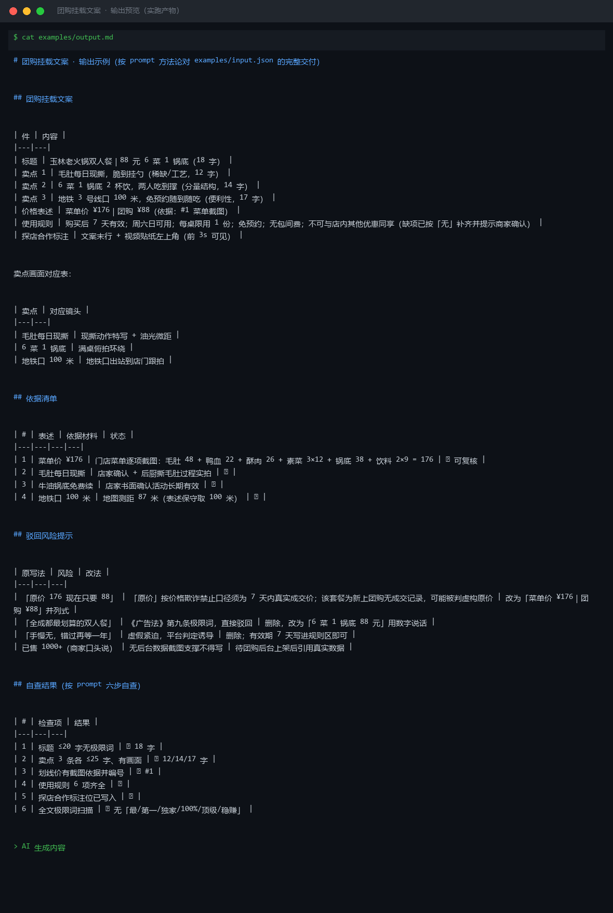
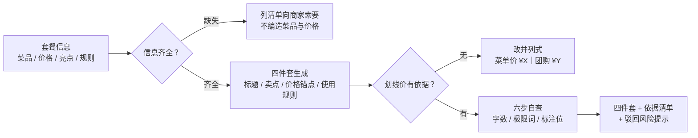

# 团购挂载文案 Groupbuy Attach Copy

> 原子技能 ｜ 属于「探店编导」 ｜ 本地生活商家客群 ｜ T2 提示词型
>
> **把团购套餐写成能挂上视频的转化文案（标题/卖点/价格锚点/使用规则四件套），且每一句都经得起平台审核。**
> 标题 ≤20 字 · 卖点 3 条各 ≤25 字且每条有对应画面 · 价格锚点 6 种表述可用性逐项核对 · 使用规则 6 项缺一即售后纠纷 · 输出前六步自查



🎬 **[▶ 观看演示视频](docs/assets/demo.mp4)** — 四幕检测叙事：业务钩子 → 真实执行 → 检查项逐条亮灯 → 交付物

*上图是本技能对 `examples/input.json` 的实跑交付（`examples/output.md`）：标题 18 字达标，依据清单 4 项全部「可复核」，驳回风险提示 4 条。*

---

## 它做什么（团购文案四件套，逐件输出）

**① 标题**：公式 `[人群/场景] + [套餐价值] + [数字锚点]`，靠具体不靠夸张——「6 菜 1 锅底」>「超值双人餐」。

**② 卖点区**（3 条，按转化权重排序）：稀缺/工艺 → 分量结构（报具体菜品数）→ 便利性。每条必须能对应一个可拍的画面，写不出画面的卖点删掉。

**③ 价格锚点（合规核心）**：

| 表述 | 可用性 | 依据要求 |
|---|---|---|
| 「88 元双人餐」 | ✅ 直接用 | 套餐真实售价 |
| 「菜单价 176 元」 | ✅ 可用 | 门店菜单/收银截图，逐项加总可复核 |
| 「原价 176 元」 | ⚠️ 慎用 | 「原价」须为 7 天内真实成交价，无成交记录不得写 |
| 「限时 5 折」 | ⚠️ 慎用 | 折扣基线同上，且标注活动起止日期 |
| 「全网最低价」 | ❌ 禁用 | 《广告法》第九条极限词 |
| 「原价 999 现 88」 | ❌ 禁用 | 虚构原价属价格欺诈 |

**④ 使用规则 6 项**：有效期 / 适用时段 / 限购 / 需预约否 / 包间费·服务费 / 优惠叠加——限制条件必须前置可见，不为转化率隐藏。

**六步自查**：标题 ≤20 字无极限词 → 卖点各 ≤25 字有画面 → 划线价有截图依据 → 规则 6 项齐全 → 探店合作标注位已写入 → 全文过极限词表。

## 真实输入 → 真实输出

**输入**（`examples/input.json`）：

```json
{
  "store_name": "玉林陈记老火锅",
  "deal_name": "双人火锅套餐（毛肚+鸭血+酥肉+3素菜+牛油锅底+2饮料）",
  "price": 88,
  "list_price_basis": "门店菜单价合计 176 元（菜单截图 #1）",
  "platform": "抖音团购"
}
```

**输出**（节选，完整见 [`examples/output.md`](examples/output.md)）：

| 件 | 内容 |
|---|---|
| 标题 | 玉林老火锅双人餐｜88 元 6 菜 1 锅底（18 字） |
| 卖点 1 | 毛肚每日现撕，脆到挂勺（稀缺/工艺，12 字） |
| 卖点 2 | 6 菜 1 锅底 2 杯饮，两人吃到撑（分量结构，14 字） |
| 卖点 3 | 地铁 3 号线口 100 米，免预约随到随吃（便利性，17 字） |
| 价格表述 | 菜单价 ¥176｜团购 ¥88（依据：#1 菜单截图，逐项加总可复核） |

**驳回风险提示**（实跑输出 4 条）：「原价 176 现在只要 88」→ 改「菜单价 ¥176｜团购 ¥88」并列式；「全成都最划算」→ 极限词驳回，用数字说话；「手慢无」→ 虚假紧迫删除；「已售 1000+」→ 无后台数据不得写。

## 处理流水线



## 快速开始

```text
1. 打开 prompt.txt，全文复制
2. 粘贴到 Coze / WorkBuddy / Dify / Claude / ChatGPT
3. 按 schema.json 提供：套餐名 / 价格 / 菜单价依据 / 亮点 / 使用规则 / 平台
```

## 面向谁 / 什么时候用

| ✅ 该用 | ❌ 别用 |
|---|---|
| 团购套餐上架前写挂车文案与详情四件套 | 设计套餐、定价、谈佣金（不改价只说明） |
| 划线价写法拿不准，要合规改法 | 虚构原价/销量，建议刷单刷好评 |
| 商家付费探店的内容挂载（标注「探店合作」） | 餐饮功效宣称（「降尿酸锅底」类） |

## 边界与合规

- 输出标注 **AI 生成内容**；文案仅作草稿，上架前经商家与平台双重确认
- 探店挂车带货属互联网广告，须显著标注「探店合作」（[《互联网广告管理办法》第 9 条](../aigc-label-compliance/README.md)）
- 价格表述以官方最新划线价口径为准；涉及价格法问题建议咨询当地市监部门

## 文件地图

```text
├── README.md            ← 本文件
├── SKILL.md             ← 资产定义（元信息 / 契约 / 边界）
├── prompt.txt           ← 提示词本体（四件套 + 价格锚点表 + 六步自查）
├── schema.json          ← 输入输出契约（机器可读）
├── examples/            ← 真实输入 + 完整交付示例
└── docs/                ← 9 项配套文档（架构 / 流程 / 场景 / 测试报告…）
```

---

*本资产遵循 [bangwozuo 数字员工资产规范](https://github.com/bangwozuo/digital-employee-spec) v3.0 ｜ [所属员工：探店编导](../../) ｜ [总入口](https://github.com/bangwozuo/digital-employees-hub-zh)*
