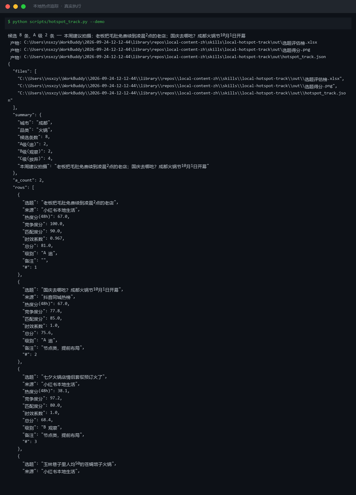
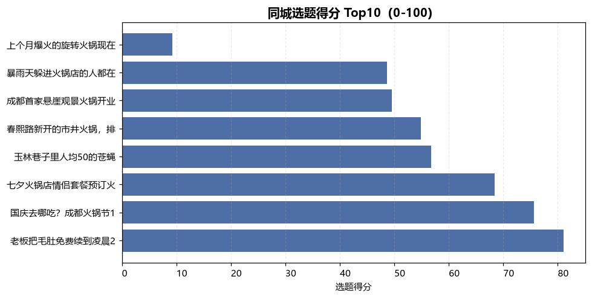
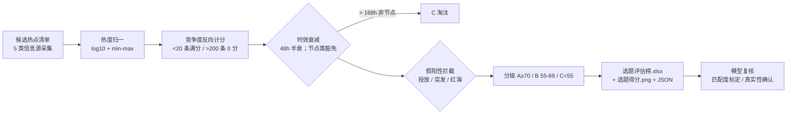

# 本地热点追踪 Local Hotspot Track

> 原子技能 ｜ 属于「探店编导」 ｜ 本地生活商家客群 ｜ T1 产物型（脚本交付真实文件）
>
> **把同城信息源的噪声筛成「本周值得拍的 3 条选题」：三因子加权评分 + 48h 半衰时效衰减 + 4 类假阳性拦截。**
> 评分公式 0.4 热度 + 0.3 竞争度 + 0.3 匹配度 · 互动量 log10 归一 · 竞争度 <20 条满分 >200 条 0 分 · 超 7 天淘汰 · 分级 A≥70 追 / B 55-69 观察 / C<55 放弃



*上图来自真实执行（`python scripts/hotspot_track.py --demo`）：8 条候选热点 → A 级 2 / B 级 2 / C 级 4，Top1「毛肚免费续到凌晨 2 点的老店」81.0 分（低竞争 + 高匹配 + 6h 新热点）。*



*实跑产物：`out/选题得分.png` Top10 得分柱状图；另有 `out/选题评估榜.xlsx`（A 级行标红）与 `out/hotspot_track.json`。*

---

## 它算什么（三因子加权评分）

```
选题得分 = 热度分 × 0.4 + 竞争度分 × 0.3 + 匹配度分 × 0.3
```

| 因子 | 口径 | 权重 |
|---|---|---|
| 热度分 | 近 48h 互动量（赞+评+藏）取 log10 后 min-max 归一化 0-100（跨数量级，线性归一会被爆款压扁其余贴地） | 0.4 |
| 竞争度分 | 同城同类视频 <20 条满分，>200 条 0 分，中间线性插值——发得越多的题越难抢流量 | 0.3 |
| 匹配度分 | 与门店品类/客单价/位置的重合度（0-1），人工标定，脚本只做加权 | 0.3 |
| 时效衰减 | 半衰 48h：得分 × (0.6 + 0.4 × 衰减系数)；**超 7 天直接淘汰** | 乘数 |

**分级判定**：A 追（≥70，24h 内出脚本）/ B 观察（55-69，次日复查热度）/ C 放弃（<55）。

**假阳性拦截（决定榜单可不可用）**：① 节点类（情人节/五一/国庆/春节等 11 个节点词）不按衰减淘汰，标「节点类，提前布局」；② 开业 <15 天全是探店号发的热度 → 疑似投放，热度打 7 折；③ 天气/突发事件直接剔除；④ 同类视频 >500 条标「红海，竞争度已计 0 分」。

## 真实输入 → 真实输出

**输入**（`examples/input.json`）：成都 / 火锅 / 8 条候选（title / source / heat_48h / same_city_videos / match / hours_since）。

**输出**（脚本实跑，选题榜节选）：

| # | 选题 | 热度分 | 竞争度分 | 时效系数 | 总分 | 级别 | 备注 |
|---|---|---|---|---|---|---|---|
| 1 | 老板把毛肚免费续到凌晨2点的老店 | 67.0 | 100.0 | 0.967 | **81.0** | A 追 | 低竞争+高匹配，6h 新热点 |
| 2 | 国庆去哪吃？成都火锅节10月1日开幕 | 67.0 | 77.8 | 1.000 | 75.6 | A 追 | 节点类，提前布局 |
| 5 | 春熙路新开的市井火锅，排队2小时也要吃 | 81.2 | 0.0 | 0.900 | 54.9 | C 放弃 | 同城同类 260 条，红海 |
| 7 | 暴雨天躲进火锅店的人都在拍这一幕 | 100.0 | 0.0 | 0.936 | 48.7 | C 放弃 | 疑似投放/红海 |
| 8 | 上个月爆火的旋转火锅现在凉凉了 | 0.0 | 0.0 | 0.612 | 9.2 | C 淘汰 | 超 7 天淘汰 |

完整 8 条见 [`examples/output.md`](examples/output.md)。注意第 7 条：互动量 21 万全榜最高仍被正确淘汰——这就是竞争度反向计分与假阳性拦截的价值。

## 处理流水线



## 快速开始

**方式一：提示词（任意 AI 工具）**

```text
1. 打开 prompt.txt，全文复制
2. 粘贴到 Coze / WorkBuddy / Dify / Claude / ChatGPT
3. 按 schema.json 提供：城市 / 品类 / 候选热点（拿不到数据就粘贴热榜条目，不估数）
```

**方式二：脚本（零 AI 依赖，确定性计算）**

```bash
# 演示模式（内置成都火锅真实样例）
python scripts/hotspot_track.py --demo
# 指定输入
python scripts/hotspot_track.py --input examples/input.json --outdir out
```

依赖：`pip install openpyxl matplotlib`（缺失时脚本会打印修复命令）。

## 面向谁 / 什么时候用

| ✅ 该用 | ❌ 别用 |
|---|---|
| 每天 7:00 选题决策「今天拍什么」 | 代替人跑同城页抓数据（候选由用户粘贴/连接器供给） |
| 候选多到挑花眼，要排序和淘汰理由 | 蹭竞争对手负面舆情热点（法律风险，脚本也会拦） |
| 节点选题提前 7-14 天布局 | 把全网热点当同城热点（异地爆点≠本城需求） |

## 边界与合规

- 输出标注 **AI 生成内容**；热榜数据为平台公开信息，引用时注明来源与采集时间
- 数值计算以脚本输出为准，模型不口算；匹配度标定与假阳性排除须由模型按 prompt.txt 复核
- 涉及商家合作的选题，成片须按《互联网广告管理办法》标注「探店合作」；发布保留人工确认环节

## 文件地图

```text
├── README.md                    ← 本文件
├── SKILL.md                     ← 资产定义（元信息 / 契约 / 边界）
├── prompt.txt                   ← 提示词本体（信息源清单 + 评分公式 + 假阳性拦截）
├── schema.json                  ← 输入输出契约（机器可读）
├── scripts/hotspot_track.py     ← 确定性评分脚本（三因子加权 → xlsx/png/json）
├── examples/                    ← 真实输入 + 脚本实跑输出
├── docs/                        ← 9 项配套文档（架构 / 流程 / 场景 / 测试报告…）
└── out/                         ← 实跑产物（选题评估榜.xlsx / 选题得分.png / JSON）
```

---

*本资产遵循 [bangwozuo 数字员工资产规范](https://github.com/bangwozuo/digital-employee-spec) v3.0 ｜ [所属员工：探店编导](../../) ｜ [总入口](https://github.com/bangwozuo/digital-employees-hub-zh)*
