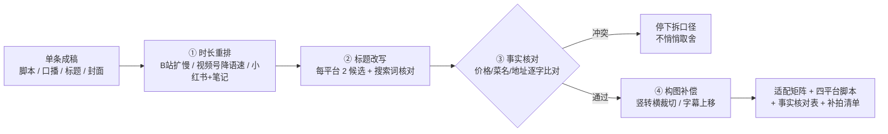

# 多平台规格适配 Multi-Platform Spec Adapt

> 原子技能 ｜ 属于「探店编导」 ｜ 本地生活商家客群 ｜ T2 提示词型
>
> **一条素材进，四份平台版出：按抖音/小红书/视频号/B 站各自的画幅、时长、标题、开头节奏重排信息，改写不动事实。**
> 四平台规格卡 8 维度 · 标题上限 30/20/16/40 字符 · 时长重排先于文字改写 · 事实核对表逐条打勾 · 竖转横构图补偿方案


🎬 **[▶ 观看演示视频（在线播放）](https://cdn.jsdelivr.net/gh/bangwozuo/local-content-zh@main/skills/multi-platform-spec-adapt/docs/assets/demo.mp4) · [GitHub 页](https://github.com/bangwozuo/local-content-zh/blob/main/skills/multi-platform-spec-adapt/docs/assets/demo.mp4)** — 四幕创作叙事：业务钩子 → 真实执行 → 要点到成稿演变 → 交付物

*上图是本技能对 `examples/input.json` 的实跑交付（`examples/output.md`）：60s 抖音原版扩出小红书 75s / 视频号 60s / B 站 2min40s 三版，6 项事实全部核对通过。*

---

## 它做什么（四平台规格卡）

| 项 | 抖音 | 小红书 | 视频号 | B 站 |
|---|---|---|---|---|
| 画幅 | 9:16（1080×1920） | 9:16 | 9:16 或 16:9 | 16:9（1920×1080） |
| 时长 | ≤60s，探店 30-60s 最佳 | ≤4min，探店 60-90s 最好 | 竖版 ≤60s 流量更好 | 横屏 2-5min |
| 标题 | ≤30 字符，前 10 字见钩子 | ≤20 字，标题即搜索关键词 | ≤16 字利转发 | ≤40 字符信息量型 |
| 封面 | 竖版 3:4/9:16 大字报 | **3:4 封面决定点击** | 竖版大字（去价格字） | 横版 3 信息点 |
| 开头 | 0-3s 决生死 | 前 2 行笔记文字 | 前 5s 温和钩子 | 前 30s 决定弃片率 |
| 调性 | 强节奏、卡点 | 第一人称生活流 | 克制、家庭向 | 高信息密度 |
| 挂载 | 团购 POI | 笔记挂团购/地址 | 门店名/公众号 | 评论区置顶 |

**适配改写规则（逐平台执行）**：

1. **时长重排先于文字**：60s 抖音版 → B 站把 3-25s B-roll 拆成「菜品逐个点评」扩到 2-3min；→ 视频号语速 5 字/秒降到 4 字/秒，换家庭场景钩子；→ 小红书 60-90s 另出笔记版（正文 ≤1000 字，每段 emoji ≤3 个）
2. **标题改写每平台 2 候选**：抖音钩子前置 / 小红书搜索词前置（「成都/玉林/火锅/人均」至少含 2 个搜索词）/ 视频号场景共鸣 / B 站信息量型
3. **事实保真**：价格、菜名、数量、地址、活动条款**逐字保留**，附「事实核对表」逐条打勾；极限词不因换平台放行
4. **竖转横构图补偿**：特写裁 16:9 安全框防两侧穿帮；字幕从底部上移到下三分之一（避开进度条）；无补拍用「居中+两侧模糊延展」并标注下次双机位

## 真实输入 → 真实输出

**输入**（`examples/input.json`）：60s 抖音版脚本全文 + `facts` 事实清单 6 项 + `targets: ["小红书", "视频号", "B站"]`。

**输出**（适配矩阵节选，完整见 [`examples/output.md`](examples/output.md)）：

| 平台 | 时长 | 标题候选 | 开头改动 |
|---|---|---|---|
| 小红书 | 75s | 成都玉林火锅推荐｜人均65 现撕毛肚（18 字） | 「被本地朋友带来的，不是探店号」 |
| 视频号 | 60s | 带爸妈吃玉林 20 年老火锅（13 字） | 「今天带爸妈来吃他们年轻时常来的味道」 |
| B 站 | 2min40s | 成都玉林巷子火锅实测：176 元菜单价吃出什么水平（24 字） | 前 30s 讲清看点，账单最后公布 |

**事实核对表（实跑值）**：人均 65 元 / 团购 88 元双人餐 / 菜单价 176 元 / 地址玉林横街 / 毛肚每日现撕 / 牛油锅底免费续——6 项 ✅（视频号版「改挂门店名不报价」已单独注明口径）。**需补拍/重剪清单 4 条**：B 站横构图毛肚特写、小红书 3:4 封面、删 1 处慢动作、横屏字幕上移。

## 处理流水线



## 快速开始

```text
1. 打开 prompt.txt，全文复制
2. 粘贴到 Coze / WorkBuddy / Dify / Claude / ChatGPT
3. 按 schema.json 提供：成稿全文 / facts 事实清单 / source_platform / targets
```

## 面向谁 / 什么时候用

| ✅ 该用 | ❌ 别用 |
|---|---|
| 一条拍好的内容要发多平台，不想「翻译腔换词」 | 把 60s 注水成 3min 凑时长（信息密度 <1 点/20s 即失败） |
| 竖版转 B 站横屏拿不准构图怎么改 | 改动价格、菜名、地址等事实 |
| 各平台标题字数/封面规格记不住 | 抖音版加「点赞关注不迷路」（引流降权） |

## 边界与合规

- 所有输出标注 **AI 生成内容**，四平台版本统一保留 AI 标识与探店合作标注
- 规格卡为 2026 年常见口径，平台改版频繁——发布前以官方最新公示为准，卡片过期时明确标「待核对官方」
- 各平台团购挂载规则不同，挂载动作前由商家/达人人工确认

## 文件地图

```text
├── README.md            ← 本文件
├── SKILL.md             ← 资产定义（元信息 / 契约 / 边界）
├── prompt.txt           ← 提示词本体（四平台规格卡 + 改写规则）
├── schema.json          ← 输入输出契约（机器可读）
├── examples/            ← 真实输入 + 完整交付示例
└── docs/                ← 9 项配套文档（架构 / 流程 / 场景 / 测试报告…）
```

---

*本资产遵循 [bangwozuo 数字员工资产规范](https://github.com/bangwozuo/digital-employee-spec) v3.0 ｜ [所属员工：探店编导](../../) ｜ [总入口](https://github.com/bangwozuo/digital-employees-hub-zh)*
