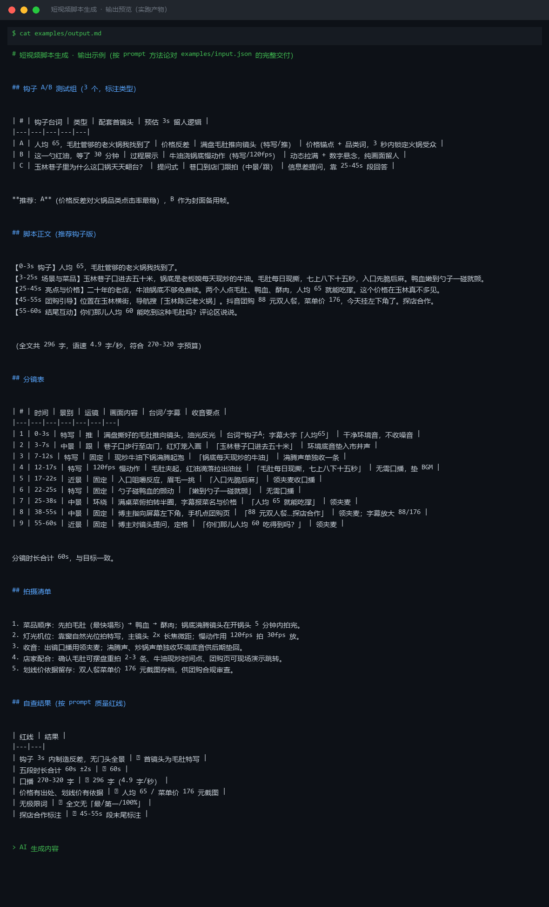
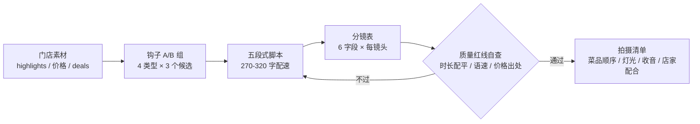

# 短视频脚本生成 Shortvideo Script Generate

> 原子技能 ｜ 属于「探店编导」 ｜ 本地生活商家客群 ｜ T2 提示词型
>
> **把门店素材写成「拿去就能开拍」的脚本：每句台词有画面对应，每个镜头有时长预算。**
> 五段式 60s 结构 · 口播 270-320 字（4.5-5.5 字/秒）· 钩子 4 类型 A/B 备选 · 分镜 6 字段缺一不可 · 质量红线 4 条自查



*上图是本技能对 `examples/input.json` 的实跑交付（`examples/output.md`）：全文 296 字、语速 4.9 字/秒，9 镜分镜合计 60s，与目标时长逐秒对齐。*

---

## 它做什么（五段式结构，逐段给足画面信息）

| 时段 | 段落 | 任务 | 口播字数预算 | 拍法要点 |
|---|---|---|---|---|
| 0-3s | 钩子 | 决定完播率的 3 秒 | ≤ 15 字 | 画面必须有动态（拉丝/爆汁/热气），**不放品牌门头** |
| 3-25s | 场景与菜品 | 堆「值得来」的证据 | 90-110 字 | 3-5 个菜品特写 + 环境中景交替，每镜头 2-4 秒 |
| 25-45s | 亮点与价格 | 记忆点 + 消费锚点 | 90-110 字 | 招牌菜拍「入口反应」，人均价字幕同步放大 |
| 45-55s | 团购引导 | 流量导向核销 | 40-55 字 | 口播说位置+优惠，字幕给 POI；**探店合作在此标注** |
| 55-60s | 结尾互动 | 留评论钩子 | ≤ 20 字 | 提问式结尾，不停在静态画面 |

**钩子类型库**（每次至少备 3 个供 A/B 选择）：价格反差 / 稀缺排队（必须真实，虚构属违规）/ 提问式 / 过程展示。三条铁律：第一句 ≤15 字、不出现品牌全称、画面与台词说同一件事。

**质量红线（写完自查，任一不过就重写）**：钩子 3s 内制造信息差（完播预期 >30% 合格、>50% 优秀）；五段合计 = 目标时长 ±2s；口播 270-320 字（60s 版，45s 版 200-240 字、30s 版 130-160 字等比缩）；价格必须有出处，不估算。

**分镜 6 字段**：`#` / 时间 / 景别（特写·近景·中景·全景）/ 运镜（固定·推·跟·摇·环绕）/ 画面内容（具体到「毛肚夹起时的拉丝」）/ 台词·字幕 / 收音要点。美食镜头黄金参数：自然光靠窗位、微距端对焦质地、慢动作 120fps 拍 30fps 放且全片 ≤2 处。

## 真实输入 → 真实输出

**输入**（`examples/input.json`）：

```json
{
  "store_name": "玉林陈记老火锅",
  "highlights": ["毛肚每日现撕", "牛油锅底免费续", "老板娘坐镇 20 年"],
  "price_per_head": 65,
  "deals": "抖音团购 88 元双人餐（原价依据：门店菜单价合计 176 元）",
  "duration_s": 60, "platform": "抖音"
}
```

**输出**（分镜表节选，完整见 [`examples/output.md`](examples/output.md)）：

| # | 时间 | 景别 | 运镜 | 画面内容 | 台词/字幕 |
|---|---|---|---|---|---|
| 1 | 0-3s | 特写 | 推 | 满盘撕好的毛肚推向镜头，油光反光 | 钩子 A「人均 65，毛肚管够的老火锅我找到了」 |
| 4 | 12-17s | 特写 | 120fps 慢动作 | 毛肚夹起，红油滴落拉出油丝 | 「毛肚每日现撕，七上八下十五秒」 |
| 7 | 25-38s | 中景 | 环绕 | 满桌菜俯拍转半圈，字幕报菜名与价格 | 「人均 65 就能吃撑」 |
| 8 | 38-55s | 中景 | 固定 | 博主指向左下角团购页 | 「88 元双人餐…探店合作」 |
| 9 | 55-60s | 近景 | 固定 | 博主对镜头提问，定格 | 「你们那儿人均 60 吃得到吗？」 |

## 处理流水线



## 快速开始

```text
1. 打开 prompt.txt，全文复制
2. 粘贴到 Coze / WorkBuddy / Dify / Claude / ChatGPT
3. 按 schema.json 提供：门店名 / 亮点 / 人均价 / 套餐 / 目标时长 / 平台
```

提示词方式产出到对话；需要对分镜做确定性时长/语速实数校验时，用工作流 [`storevisit-script-generate-flow`](../../workflows/storevisit-script-generate-flow/README.md)（`run_flow.py` 脚本校验）。

## 面向谁 / 什么时候用

| ✅ 该用 | ❌ 别用 |
|---|---|
| 老板拍店前要一份「照着拍就行」的脚本 | 账号定位、剪辑、投放（本技能不做） |
| 45s / 30s 短版按等比字数缩放复用 | 虚构排队/翻台率/价格凑亮点 |
| 探店合作内容（45-55s 段强制标注位） | 承诺播放量与涨粉 |

## 边界与合规

- 输出为 **AI 辅助生成内容**，发布前须人工审核并按平台规则完成 AI 标识
- 不虚构稀缺性与价格；「探店合作」标注位缺失的版本不放行
- 脚本只到「可拍摄」为止；挂团购版本须先过 [团购挂载文案](../groupbuy-attach-copy/README.md) 合规检查

## 文件地图

```text
├── README.md            ← 本文件
├── SKILL.md             ← 资产定义（元信息 / 契约 / 边界）
├── prompt.txt           ← 提示词本体（五段式 + 钩子库 + 质量红线）
├── schema.json          ← 输入输出契约（机器可读）
├── examples/            ← 真实输入 + 完整交付示例
└── docs/                ← 9 项配套文档（架构 / 流程 / 场景 / 测试报告…）
```

---

*本资产遵循 [bangwozuo 数字员工资产规范](https://github.com/bangwozuo/digital-employee-spec) v3.0 ｜ [所属员工：探店编导](../../) ｜ [总入口](https://github.com/bangwozuo/digital-employees-hub-zh)*
