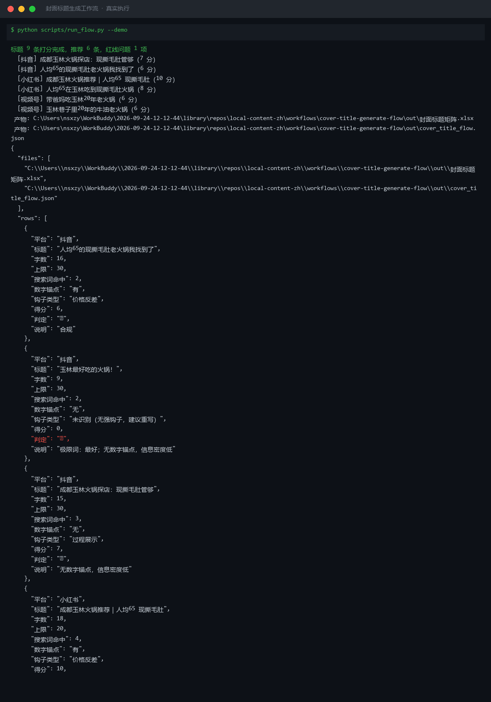
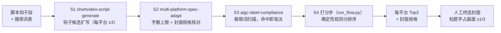

# 封面标题生成工作流 Cover Title Generate Flow

> 工作流（T3 复合）｜ 属于「探店编导」 ｜ 本地生活商家客群 ｜ 人工触发 ｜ ROI：每条省 15 分钟纠结时间
>
> **把脚本钩子变成每个平台 2 个可上封面的标题：字数、极限词、搜索词、封面规格四道核对，确定性规则分排序，人工只做终选。**
> DAG 节点 = shortvideo-script-generate → multi-platform-spec-adapt → aigc-label-compliance → 打分步 · 打分公式 2×搜索词 + 数字锚点 − 5×极限词 · 每平台 Top2 A/B 备选 · 每平台省 15 分钟纠结时间




*上图来自真实执行（`python scripts/run_flow.py --demo`）：三平台 9 条候选打分完成——红线 1 条（「玉林最好吃的火锅！」极限词 0 分淘汰）、推荐 6 条（每平台 Top2）。*

---

## 流程 DAG（节点均为本仓真实技能）



## 打分公式（S4，分数以脚本输出为准，不口算）

```
标题得分 = 2 × 搜索词命中数 + 数字锚点(有=1) + 字数达标(是=1) − 5 × 极限词命中数
```

| 分量 | 为什么这么设计 |
|---|---|
| 搜索词 ×2 | 标题含城市/商圈/品类/价格词决定搜索流量；不含词的「绝了家人们」在搜索池里裸奔 |
| 数字锚点 | 「人均 65」「20 年」决定信息密度 |
| 极限词 ×(−5) | 「玉林最好吃的火锅」读着带劲但直接驳回且无信息量——规则分里它得 0 分 |

**钩子类型归类**：价格反差 / 稀缺排队 / 提问式 / 过程展示（关键词映射）；四类都不沾的标「无强钩子，建议重写」。候选全部 🔴 → 输出空推荐 + 整改要求，**不带病放行**。

## 真实输入 → 真实输出

**输入**（`examples/input.json`）：玉林陈记老火锅 / 搜索词 4 个（成都/玉林/火锅/人均）/ 三平台 9 条候选。

**输出**（平台推荐，脚本实跑值，完整见 [`examples/output.md`](examples/output.md)）：

| 平台 | 推荐标题 | 得分 | 封面规格 |
|---|---|---|---|
| 小红书 | 成都玉林火锅推荐｜人均65 现撕毛肚 | 10（搜索词 4 命中+数字锚点） | 3:4 封面（点击率命门），首图含标题字 |
| 抖音 | 成都玉林火锅探店：现撕毛肚管够 | 7 | 竖版大字报，标题字占画面 ≥1/3 |
| 视频号 | 带爸妈吃玉林20年老火锅 | 6 | 竖版大字，**去价格字**（熟人场忌报价） |

**问题清单（实跑值）**：🔴 抖音「玉林最好吃的火锅！」极限词「最好」0 分淘汰 → 整改方向：改具体数字锚点「玉林人均 65 的现撕毛肚火锅」。

**产物**：`out/封面标题矩阵.xlsx`（候选打分 + 平台推荐两 sheet，红线标红）、`out/cover_title_flow.json`。

## 快速开始

```bash
# 演示模式（内置真实样例）
python scripts/run_flow.py --demo
# 指定输入
python scripts/run_flow.py --input examples/input.json --outdir out
```

提示词方式：复制 `prompt.txt` 到任意 AI 工具，按 DAG 顺序执行（红线未清不进打分）。

## 面向谁 / 什么时候用

| ✅ 该用 | ❌ 别用 |
|---|---|
| 脚本定稿后出封面标题矩阵（A/B 备选是硬要求） | 跳过人工终选直接出图发布 |
| 标题在「感觉不错」和「搜索有流量」之间摇摆 | 编造搜索词命中（只按用户词表核对） |
| 想知道哪条标题会因极限词白写 | 未知平台硬编规格（标「待核对官方」） |

## 边界与合规

- 输出标注 **AI 生成内容**；标题与封面按平台规则完成 AI 标识
- 不产出含极限词的标题，即使「用户要求」也不放行（给替换方案）
- 涉及合作内容，终选时确认「探店合作」标注位不与封面主文案冲突；封面与标题一致性由人工核对

## 文件地图

```text
├── README.md               ← 本文件
├── SKILL.md                ← 资产定义（DAG / 契约 / 边界）
├── prompt.txt              ← 编排提示词（四步明细 + 打分公式 + 失败模式）
├── schema.json             ← 输入输出契约（机器可读）
├── scripts/run_flow.py     ← 确定性打分脚本（四道核对 → xlsx/json）
├── examples/               ← 真实输入 + 脚本实跑输出
├── docs/                   ← 9 项配套文档（架构 / 流程 / 场景 / 测试报告…）
└── out/                    ← 实跑产物（封面标题矩阵.xlsx / JSON）
```

---

*本资产遵循 [bangwozuo 数字员工资产规范](https://github.com/bangwozuo/digital-employee-spec) v3.0 ｜ [所属员工：探店编导](../../) ｜ [总入口](https://github.com/bangwozuo/digital-employees-hub-zh)*
