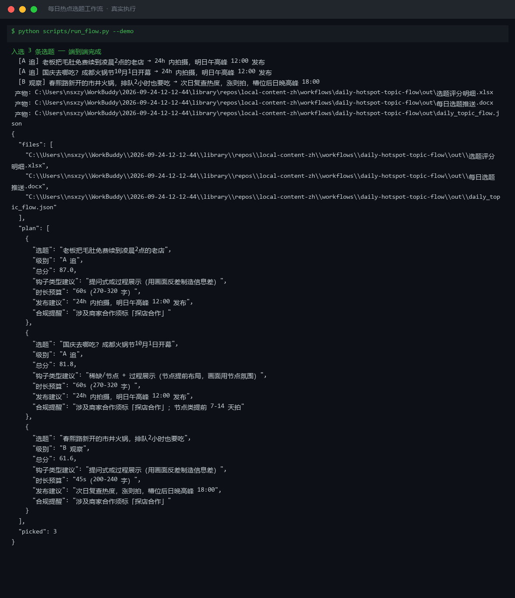

# 每日热点选题工作流 Daily Hotspot Topic Flow

> 工作流（T3 复合）｜ 属于「探店编导」 ｜ 本地生活商家客群 ｜ 定时触发（每日 7:00）
>
> **每天早上把同城信息源的噪声变成「今天拍什么、几点发」的三张选题卡——老板不用再自己刷 30 分钟热点。**
> DAG 节点 = local-hotspot-track → shortvideo-script-generate · 三因子加权评分 · A 级 ≥1 才走主路 · A 级 24h 内拍 / 次日午高峰 12:00 发布 · ROI：替代刷热点 30 分钟/天 ≈ 月省 15 小时



*上图来自真实执行（`python scripts/run_flow.py --demo`）：成都/火锅 6 条候选 → 入选 3 条（A 级 2 条优先），Top1「毛肚免费续到凌晨 2 点的老店」87.0 分，附钩子类型、时长预算与发布槽位。*

---

## 流程 DAG（节点均为本仓真实技能）


## 两步做什么

| 步骤 | 处理 | 关键规则 |
|---|---|---|
| S1 local-hotspot-track | 选题评分 | 热度(log归一)×0.4 + 竞争度(反向, <20 条满分 >200 条 0 分)×0.3 + 匹配度×0.3；48h 半衰衰减（节点类豁免）；分级 A≥70 / B 55-69 / C<55；**数值以脚本输出为准，不口算** |
| S2 shortvideo-script-generate | 拍摄要点卡 | 钩子类型四选一（含价格词→价格反差；含节点词→稀缺+节点）；时长预算 A 级 60s（270-320 字）/ B 级 45s（200-240 字）；发布槽位 A 级 24h 内拍、次日 12:00 发，B 级次日复查涨则拍、后日 18:00 发 |

**失败处理**：候选 <3 条 → 中止索要热榜条目，不编造；单条缺 heat_48h/hours_since → 标「数据不全」不参与归一化；全部 C 级 → 照常出榜 + 「本周无必追选题」，**不强行抬级**；竞争对手负面选题 → 拒绝出卡。

## 真实输入 → 真实输出

**输入**（`examples/input.json`）：成都 / 火锅 / 6 条候选热点。

**输出**（选题卡节选，脚本实跑值，完整见 [`examples/output.md`](examples/output.md)）：

| 选题 | 级别/总分 | 钩子类型建议 | 发布建议 |
|---|---|---|---|
| 老板把毛肚免费续到凌晨2点的老店 | A 追（87.0 分） | 提问式或过程展示 | 24h 内拍摄，明日午高峰 12:00 发布 |
| 国庆去哪吃？成都火锅节10月1日开幕 | A 追（81.8 分） | 稀缺/节点（提前布局） | 24h 内拍摄；节点类提前 7-14 天拍 |
| 春熙路新开的市井火锅 | B 观察（61.6 分） | 提问式或过程展示 | 次日复查热度，槽位后日晚高峰 18:00 |

**产物**：`out/每日选题推送.docx`（选题卡+淘汰名单+确认点）、`out/选题评分明细.xlsx`（A 级行标红）、`out/daily_topic_flow.json`。

## 处理流水线之外的假阳性防线（本流特有）

- **热榜数据是昨天的**：hours_since 未更新会让 72h 老热点装新热点——S1 前核对采集时间戳
- **节点类被衰减误杀**：国庆/七夕话题 48h 后热度看似回落，实为提前布局期，节点词候选不参与衰减
- **红海高热度陷阱**：同城同类 >200 条的选题只出差异化角度卡，不出「爆款钩子」
- **B 级复查掉档**：次日互动量跌 >30% 直接降 C，不进拍摄

## 快速开始

```bash
# 演示模式（内置成都火锅样例）
python scripts/run_flow.py --demo
# 指定输入
python scripts/run_flow.py --input examples/input.json --outdir out
```

提示词方式：复制 `prompt.txt` 到任意 AI 工具，按 DAG 顺序执行（S1 未出分级不进 S2）。定时触发可接入自动化平台每日 7:00 运行。

## 面向谁 / 什么时候用

| ✅ 该用 | ❌ 别用 |
|---|---|
| 每天「不知道拍什么」的选题枯竭 | 跳过人工确认直接排期发布 |
| 候选热点由老板/连接器粘贴供给，要排序与淘汰理由 | 编造热榜条目、互动量、排队时长 |
| 节点营销提前 7-14 天布局 | 为凑 Top3 降低 A 级门槛或启用 C 级 |

## 边界与合规

- 输出标注 **AI 生成内容**；引用热榜数据注明来源与采集时间
- 选题卡中的合作类选题预告「探店合作」标注义务；确认真实性（排队/免费续等须店家确认）后才进入完整脚本生成
- 本工作流止于选题卡，不代发布；发布动作用户执行

## 文件地图

```text
├── README.md               ← 本文件
├── SKILL.md                ← 资产定义（DAG / 契约 / 边界）
├── prompt.txt              ← 编排提示词（两步明细 + 失败处理 + 假阳性）
├── schema.json             ← 输入输出契约（机器可读）
├── scripts/run_flow.py     ← 确定性编排脚本（评分+选题卡 → docx/xlsx/json）
├── examples/               ← 真实输入 + 脚本实跑输出
├── docs/                   ← 9 项配套文档（架构 / 流程 / 场景 / 测试报告…）
└── out/                    ← 实跑产物（每日选题推送.docx / 选题评分明细.xlsx / JSON）
```

---

*本资产遵循 [bangwozuo 数字员工资产规范](https://github.com/bangwozuo/digital-employee-spec) v3.0 ｜ [所属员工：探店编导](../../) ｜ [总入口](https://github.com/bangwozuo/digital-employees-hub-zh)*
