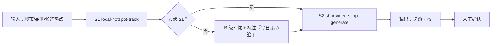

# 每日热点选题

把同城信息源噪声变成「今天拍什么、几点发」的三张选题卡，止于人工确认。

## 元信息

| 字段 | 值 |
|------|-----|
| ID | `de_local_01_wf01` |
| 类型 | **`composite`（复合技能）** |
| 所属员工 | 探店编导 |
| 阶段 | `P0` |
| 复杂度 | `M` |
| 触发方式 | 定时（每日 7:00）/ 手动 |
| ROI | 替代老板刷热点 30 分钟/天 ≈ 月省 15 小时 |
| 资产形态 | 提示词编排 + 可选 Python 编排脚本 |

## 能力描述

三步编排：**S1 评分**（三因子加权 + 48h 半衰 + 节点豁免，A≥70/B 55-69/C<55）→
**S2 选题卡**（钩子类型映射、时长预算 60s/270-320 字或 45s/200-240 字、发布槽位：
A 级次日午高峰 12:00、B 级复查后晚高峰 18:00）→ **人工确认**（真实性/档期/配合项）。

## 编排的原子技能

| # | 原子技能 | 能力 |
|---|---------|------|
| 1 | [本地热点追踪](../../skills/local-hotspot-track/) | 三因子加权评分与 A/B/C 分级 |
| 2 | [短视频脚本生成](../../skills/shortvideo-script-generate/) | 钩子类型库、时长与字数预算 |

## 步骤链路（DAG）



## 步骤明细

| # | 步骤 | 技能资产 | 输入 | 输出 | 失败处理 |
|---|------|---------|------|------|---------|
| 1 | 选题评分 | `local-hotspot-track` | city/category/candidates | 评分明细 + 级别 | 候选 <3 条中止并索要热榜粘贴；单条数据缺失标「数据不全」不估数；全 C 照常输出不抬级 |
| 2 | 拍摄要点卡 | `shortvideo-script-generate` | S1 Top3 | 3 张选题卡 | Top3 不足按实输出；竞争对手负面选题拒出卡 |
| 3 | 人工确认 | （人工） | 选题卡 | 确认后的拍摄排期 | 未确认不排期、不发布 |

## 输入规格

| 字段 | 类型 | 必填 | 说明 |
|------|------|------|------|
| `city` | string | ✅ | 门店所在城市 |
| `category` | string | ✅ | 门店品类 |
| `candidates` | array | ✅ | 候选热点（title/source/heat_48h/same_city_videos/match/hours_since） |

## 输出规格

| 字段 | 类型 | 说明 |
|------|------|------|
| `summary` | object | 候选数 / 入选数 / 城市 / 品类 |
| `plan` | array | Top3 选题卡（级别/总分/钩子类型/时长预算/发布建议/合规提醒） |
| `rows` | array | 全部候选评分明细 |
| 产物 | file | `out/每日选题推送.docx`、`out/选题评分明细.xlsx`、`out/daily_topic_flow.json` |

## 错误处理

| 情况 | 处理方式 |
|------|---------|
| 候选清单缺失 | 提示粘贴同城热榜条目，不编造 |
| hours_since 未更新（老热点装新） | S1 前核对采集时间戳 |
| B 级复查互动量跌 >30% | 直接降 C，不进拍摄 |
| 脚本依赖缺失 | 打印修复命令退出码 2，不静默失败 |

## 使用步骤

### 方式一：纯提示词编排（跨平台）

1. 把 `prompt.txt` 全文粘贴为系统提示词
2. 提供城市、品类、候选热点清单
3. 得到执行摘要 + 选题卡 + 淘汰名单 + 人工确认点
4. 逐条确认后，把入选选题交给 `shortvideo-script-generate` 出完整脚本

### 方式二：带脚本（端到端产物）

```bash
python3 <WF_DIR>/scripts/run_flow.py --input input.json --outdir out
python3 <WF_DIR>/scripts/run_flow.py --demo
```

| 平台 | 编排方式 |
|------|---------|
| **Coze / 扣子** | 新建工作流 → S1/S2 节点各填对应技能 prompt.txt → 按本 DAG 连线 |
| **Dify** | 新建 Workflow → LLM 节点链按 DAG 顺序连接 |
| **WorkBuddy** | 新建 Skill 按 prompt.txt 步骤串联 |

## 边界（不做的事）

- ❌ 不编造热榜条目与互动量；数据缺失列清单索要
- ❌ 不跳过人工确认直接排期发布
- ❌ 不为凑 Top3 降低 A 级门槛
- ❌ 不追竞争对手负面舆情选题
- ❌ 不承诺选题的播放量与涨粉效果

## 调用示例

**输入**（`examples/input.json`）：成都/火锅/6 条候选。

**输出**（脚本实跑）：

| 选题 | 级别/总分 | 发布建议 |
|---|---|---|
| 老板把毛肚免费续到凌晨2点的老店 | A 追（87.0） | 24h 内拍，次日午高峰 12:00 |
| 国庆去哪吃？成都火锅节10月1日开幕 | A 追（81.8） | 节点类提前 7-14 天 |
| 春熙路新开的市井火锅，排队2小时也要吃 | B 观察（61.6） | 次日复查热度，涨则拍 |

## 所属工作流

本资产为复合技能（工作流），是独立的端到端流程，不隶属于其他工作流。

## 合规声明

- 输出标注「AI 生成内容」；引用热榜数据注明来源与采集时间
- 合作类选题预告「探店合作」标注义务（《互联网广告管理办法》第 9 条）
- 对外发布保留人工确认环节

---

*本复合技能遵循 [bangwozuo 数字员工资产规范](https://github.com/bangwozuo/digital-employee-spec) v3.0*
