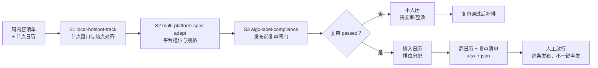

# 发布日历与复审工作流 Publish Calendar Review Flow

> 工作流（T3 复合）｜ 属于「探店编导」 ｜ 本地生活商家客群 ｜ 定时触发（每周一）｜ 复杂度 M（P1）
>
> **把一批定稿内容排成一周发布日历：每条落在对的平台、对的槽位、对的节点窗口，且复审不过不入历。**
> DAG 节点 = local-hotspot-track → multi-platform-spec-adapt → aigc-label-compliance · 槽位工作日 12:00/18:00、周末 11:00/19:00 · 每平台每天 ≤1 条 · week_start 非周一硬拒绝 · pending/failed 一律拦下


*上图来自真实执行（`python scripts/run_flow.py --demo`）：6 条内容 → 4 条入历、2 条被复审闸门拦下（pending/failed 不入历）、0 条槽位未排。*

---

## 流程 DAG（节点均为本仓真实技能）



## 三步做什么（排期以脚本输出为准，模型不手排）

| 步骤 | 处理 | 硬性规则 |
|---|---|---|
| S1 节点对齐 | 节点窗口映射到本周（默认前 2 天后 1 天）；节点内容优先排 | `week_start` 非**周一** → 报错拒绝（日历错位一周不可接受）；标签区分「（国庆）」与「（国庆窗口）」 |
| S2 槽位分配 | 工作日 12:00 午高峰 / 18:00 晚高峰；周末 11:00 / 19:00 | **每平台每天 ≤1 条**（同平台同日互抢流量）；高优先级占晚高峰；节点内容优先落正日子 |
| S3 复审闸门 | passed 才可入历；pending 标「待复审」；failed 标「整改后重审」 | 全部 pending → 输出空日历 + 复审任务清单，**不伪造排期** |

## 真实输入 → 真实输出

**输入**（`examples/input.json`）：`week_start: 2026-09-28`（周一）/ 国庆节点（窗口 −2~+1 天）/ 6 条内容（含 review_status 与 node_hint）。

**输出**（周日历节选，脚本实跑值，完整见 [`examples/output.md`](examples/output.md)）：

| 日期 | 槽位 | 平台 | 内容 | ID |
|---|---|---|---|---|
| 周一 09-28 | 18:00 晚高峰 | 抖音 | 毛肚免费续的老店 | C1 |
| 周二 09-29（国庆窗口） | 12:00 午高峰 | 小红书 | 周末探店 vlog | C5 |
| 周四 10-01（国庆） | 18:00 晚高峰 | 抖音 | 国庆火锅节逛吃攻略 | C2 |

**节点对齐核对**：C2（node_hint=国庆）落 10-01 正日子晚高峰，而非窗口首日；09-29 标「国庆窗口」供预告类内容。

**复审清单（实跑值）**：C4 视频号 pending、C6 B站 failed → **均不入历**，先完成合规复审。

**产物**：`out/发布日历.xlsx`（周日历 / 复审清单 / 未入历三 sheet）、`out/publish_calendar_flow.json`。

## 假阳性防线（本流特有）

- **复审状态过期**：三天前 passed 的内容若平台规则更新须重审——日历上超 3 天的 passed 建议人工抽查
- **周末 vlog 工作日发**：内容属性与槽位错配时提示人工调换（脚本不做语义判断，如实报告）
- **节点窗口误标**：国庆前 2 天是「窗口期」（发预告/攻略），当天才是正日子

## 快速开始

```bash
# 演示模式（内置真实样例）
python scripts/run_flow.py --demo
# 指定输入
python scripts/run_flow.py --input examples/input.json --outdir out
```

提示词方式：复制 `prompt.txt` 到任意 AI 工具，按 DAG 顺序执行（复审未过不排槽）。定时触发可接入自动化平台每周一运行。

## 面向谁 / 什么时候用

| ✅ 该用 | ❌ 别用 |
|---|---|
| 每周一排一周发布计划，怕节点错过/撞车 | 排入复审未通过的内容（没有例外） |
| 多平台多内容要槽位互斥分配 | 「一键全发」（放行必须逐条） |
| 节点营销要区分窗口期与正日子 | 输入清单与实际内容库不一致时硬排 |

## 边界与合规

- 输出标注 **AI 生成内容**；每条内容发布前核对 AI 标识与「探店合作」标注
- 节点营销内容遵守《互联网广告管理办法》合作标注义务
- 本工作流止于日历，不代发布；人工放行是逐条的

## 文件地图

```text
├── README.md               ← 本文件
├── SKILL.md                ← 资产定义（DAG / 契约 / 边界）
├── prompt.txt              ← 编排提示词（三步明细 + 假阳性 + 禁止事项）
├── schema.json             ← 输入输出契约（机器可读）
├── scripts/run_flow.py     ← 确定性排期脚本（闸门+槽位 → xlsx/json）
├── examples/               ← 真实输入 + 脚本实跑输出
├── docs/                   ← 9 项配套文档（架构 / 流程 / 场景 / 测试报告…）
└── out/                    ← 实跑产物（发布日历.xlsx / JSON）
```

---

*本资产遵循 [bangwozuo 数字员工资产规范](https://github.com/bangwozuo/digital-employee-spec) v3.0 ｜ [所属员工：探店编导](../../) ｜ [总入口](https://github.com/bangwozuo/digital-employees-hub-zh)*
