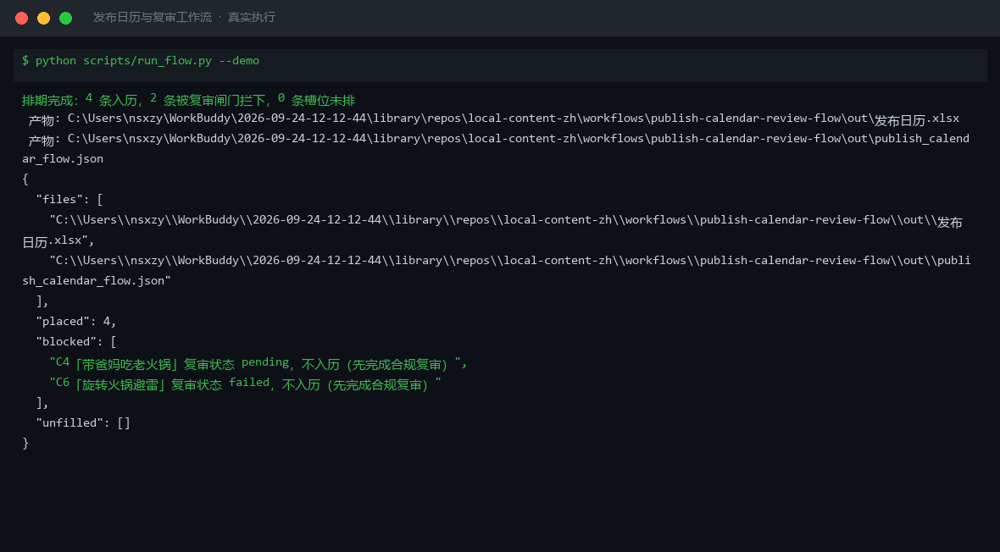

# 截图与录屏

> 以下素材均来自**真实执行**：`--run` 实拍终端 / 实跑产物文件，无摆拍。

## 演示视频


*Hyperframes 动态渲染 10s：命令逐字敲入（光标闪烁）→ 15 行真实输出逐行流式 → 完成态保持*

## 执行截图



## 实跑产物

| 文件 | 说明 |
|---|---|
| [`out/publish_calendar_flow.json`](out/publish_calendar_flow.json) | 结构化结果（实跑生成） · 3 KB |
| [`out/发布日历.xlsx`](out/发布日历.xlsx) | Excel 工作簿（实跑生成） · 7 KB |


---

## 附录：实跑输出明细

> 本资产为纯提示词客户端资产，无界面可截图。以下为**实跑运行效果**。

## 运行效果

### 输入

```json
{
  "input": {
    "source": "上周发布数据：视频 A 完播率 45%（探店），视频 B 完播率 20%（教程），视频 C 完播率 38%（热点跟拍）",
    "scope": "输出本周 7 天发布日历"
  }
}

```

### 输出

## 执行摘要

汇总上周发布数据后识别出高完播方向为"探店"与"热点跟拍"，据此排定本周 7 天发布日历。

## 分步结果

1. **步骤 1：本地热点追踪**
   - 输入：source=上周发布数据（视频 A 完播率 45% 探店/视频 B 20% 教程/视频 C 38% 热点跟拍）；scope=输出本周 7 天发布日历
   - 输出：高完播选题方向识别
2. **步骤 2：多平台规格适配**
   - 输入：上一步结论 + target=排本周 7 天发布日历
   - 输出：按平台调性调整发布节奏与文案风格

## 最终交付物

### 本周 7 天发布日历

| 日期 | 选题 | 内容形式 | 平台 | 完播预期 |
|---|---|---|---|---|
| 周一 | 探店：巷子里的老火锅 | 60s 探店脚本 | 抖音 | 高（延续上周高完播方向） |
| 周二 | 热点跟拍：秋季养生话题 | 30s 口播 | 视频号 | 中高 |
| 周三 | 探店：东南亚菜新店 | 60s 探店脚本 | 小红书 | 高 |
| 周四 | 幕后：后厨备菜日常 | 15s 快剪 | 抖音 | 中 |
| 周五 | 热点跟拍：周末去哪吃 | 30s 混剪 | 视频号 | 中高 |
| 周六 | 探店：露营风咖啡馆 | 45s 探店脚本 | 小红书 | 高 |
| 周日 | 复盘预告：下周预告 | 15s 图文 | 全平台 | 中 |

### 关键结论

- **高完播方向**：探店（45%）> 热点跟拍（38%）> 教程（20%）
- **调整策略**：本周减少纯教程类内容，增加探店与热点跟拍占比至 70%。
- **发布时段**：抖音 11:30/18:00，小红书 12:00/20:00，视频号 21:00。

> AI 生成内容


---

*运行效果由实跑验证生成*
