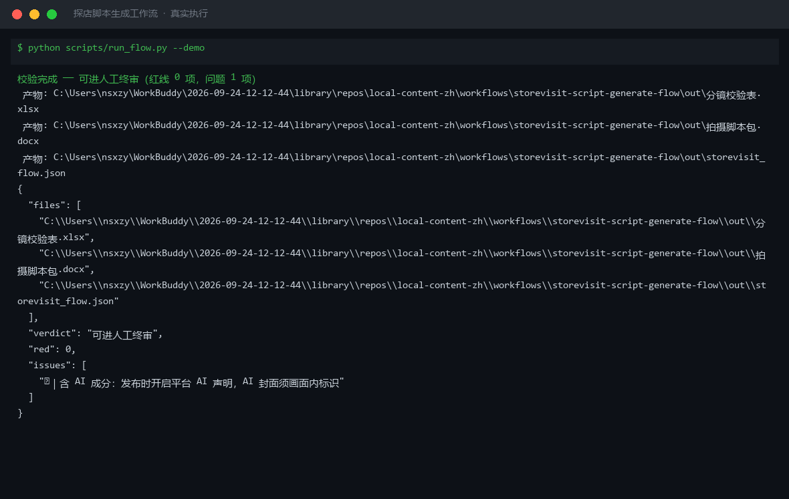
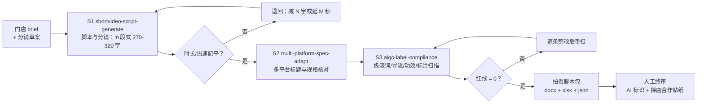

# 探店脚本生成工作流 Storevisit Script Generate Flow

> 工作流（T3 复合）｜ 属于「探店编导」 ｜ 本地生活商家客群 ｜ 定时/人工触发
>
> **把一条门店 brief 变成「写好、配平、合规」的拍摄脚本包：三步 DAG 串联本仓三个真实技能，红线未清零不放行。**
> DAG 节点 = shortvideo-script-generate → multi-platform-spec-adapt → aigc-label-compliance · 语速容差 5 字/秒 ±20% · 首镜 ≤3s 且钩子 ≤15 字 · 极限词/导流/功效/标注 4 组词表扫描



*上图来自真实执行（`python scripts/run_flow.py --demo`）：《玉林陈记老火锅》9 镜分镜合计 60s 配平达标、3 平台标题全部过规格、合规命中仅 1 项 AI 标识提示，结论「可进人工终审」。*

---

## 流程 DAG（节点均为本仓真实技能）



## 三步校验做什么（确定性部分由 `run_flow.py` 承担）

| 步骤 | 校验内容 | 硬性数字 |
|---|---|---|
| S1 脚本与分镜 | 时长配平 + 语速匹配 + 首镜钩子 | 分镜合计 = 目标 ±2s；每镜头语速 4.0-6.0 字/秒；首镜头 ≤3s、钩子台词 ≤15 字 |
| S2 多平台规格 | 标题字数与平台规格 | 抖音 ≤30 字符 / 小红书 ≤20 字 / 视频号 ≤16 字 / B 站 ≤40 字符；事实保真逐字保留 |
| S3 合规扫描 | 4 组词表 + 标注义务 | 极限词（《广告法》第 9 条）/ 站外导流 / 食品功效宣称 🔴；付费/置换未标「探店合作」🔴；AI 成分 🔵 提示 |

`words=0` 的 B-roll 镜头合法不判语速；「探店合作」只查出现与否，前 3s 可见性核对留给人工终审（明确分工，不假装脚本查过）。

## 真实输入 → 真实输出

**输入**（`examples/input.json`）：玉林陈记老火锅 / 9 镜分镜草案（no/dur_s/words/desc）/ 三平台标题 / 付费挂车文案 / `ai_involved: ["AI写稿"]`。

**输出**（脚本实跑节选，完整见 [`examples/output.md`](examples/output.md)）：

| 镜头 | 时长s | 口播字数 | 语速 | 判定 |
|---|---|---|---|---|
| 1（钩子） | 3 | 14 | 4.67 | ✅ |
| 6（B-roll） | 3 | 0 | - | ✅ 纯画面镜头 |
| 8（团购引导） | 17 | 82 | 4.82 | ✅ |

S3 扫描：`🔵 AI 成分：AI写稿 → 发布时开启平台 AI 声明`；红线 0 项。**结论：可进人工终审（红线 0，问题共 1 项）**。

**产物**：`out/拍摄脚本包.docx`（五节校验报告）、`out/分镜校验表.xlsx`（三 sheet，问题行标红）、`out/storevisit_flow.json`。

## 快速开始

```bash
# 演示模式（内置真实样例）
python scripts/run_flow.py --demo
# 指定输入
python scripts/run_flow.py --input examples/input.json --outdir out
```

台词创作属模型部分：把 `prompt.txt` 复制到任意 AI 工具，按 DAG 顺序逐步执行（S1 未配平不进 S2，S2 未完成不进 S3）。

## 面向谁 / 什么时候用

| ✅ 该用 | ❌ 别用 |
|---|---|
| 老板投喂素材照片/语音描述，要一套能开拍的脚本包 | 代发布、承诺播放量 |
| 分镜写完怕「时长注水、语速吃字」，要实数校验 | 红线未清时「先发着看」（不放行） |
| 多平台分发前的标题规格批量核对 | 编造门店信息、价格、排队数据 |

## 边界与合规

- 输出标注 **AI 生成内容**；成片按平台规则完成 AI 标识与「探店合作」标注
- 法规依据：《广告法》第 9 条、《互联网广告管理办法》第 9 条、《人工智能生成合成内容标识办法》（2025-09-01 施行）
- 不提供规避审核的谐音/拆字写法；人工终审（AI 声明开关 / 贴纸前 3s 可见 / 价格依据截图）未完成不发布

## 文件地图

```text
├── README.md               ← 本文件
├── SKILL.md                ← 资产定义（DAG / 契约 / 边界）
├── prompt.txt              ← 编排提示词（三步明细 + 失败处理 + 假阳性）
├── schema.json             ← 输入输出契约（机器可读）
├── scripts/run_flow.py     ← 确定性校验脚本（S1-S3 → docx/xlsx/json）
├── examples/               ← 真实输入 + 脚本实跑输出
├── docs/                   ← 9 项配套文档（架构 / 流程 / 场景 / 测试报告…）
└── out/                    ← 实跑产物（拍摄脚本包.docx / 分镜校验表.xlsx / JSON）
```

---

*本资产遵循 [bangwozuo 数字员工资产规范](https://github.com/bangwozuo/digital-employee-spec) v3.0 ｜ [所属员工：探店编导](../../) ｜ [总入口](https://github.com/bangwozuo/digital-employees-hub-zh)*
