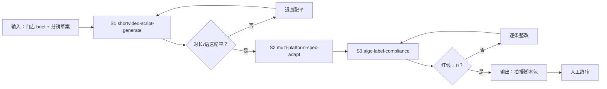

# 探店脚本生成

把门店 brief 变成「写好、配平、合规」的拍摄脚本包：脚本可开拍、标题已适配、红线已清零。

## 元信息

| 字段 | 值 |
|------|-----|
| ID | `de_local_01_wf02` |
| 类型 | **`composite`（复合技能）** |
| 所属员工 | 探店编导 |
| 阶段 | `P0` |
| 复杂度 | `L` |
| 触发方式 | 手动（接单后） |
| ROI | 一次配平三处返工：省剪辑与重拍 1-2 轮 ≈ 每次 3 小时 |
| 资产形态 | 提示词编排 + 可选 Python 编排脚本 |

## 能力描述

三步 DAG + 双闸门：**S1 脚本与配平**（五段式、钩子 A/B×3、分镜时长合计 = 目标 ±2s、
语速 4.0-6.0 字/秒、首镜 ≤3s 钩子 ≤15 字）→ **S2 多平台规格**（标题字数逐平台核对、
事实保真核对表）→ **S3 合规扫描**（极限词/导流/功效宣称词表 + 探店合作标注 + AI 标识，
红线 = 0 才放行）→ **人工终审**。

## 编排的原子技能

| # | 原子技能 | 能力 |
|---|---------|------|
| 1 | [短视频脚本生成](../../skills/shortvideo-script-generate/) | 五段式脚本、钩子库、分镜六字段 |
| 2 | [多平台规格适配](../../skills/multi-platform-spec-adapt/) | 四平台规格卡、标题改写、事实核对 |
| 3 | [AIGC 标识合规](../../skills/aigc-label-compliance/) | 四类合规扫描、放行标准 |

## 步骤链路（DAG）



## 步骤明细

| # | 步骤 | 技能资产 | 输入 | 输出 | 失败处理 |
|---|------|---------|------|------|---------|
| 1 | 脚本与配平 | `shortvideo-script-generate` | 门店 brief / 分镜草案 | 脚本 + 分镜校验 | 合计 ≠ 目标退回配平；语速超差给具体减字数；shots 为空中止索要 |
| 2 | 多平台规格 | `multi-platform-spec-adapt` | 通过的脚本 + facts | 各平台标题 + 核对表 | 标题超限给压缩候选；事实冲突拆口径；非法平台标「待核对官方」 |
| 3 | 合规扫描 | `aigc-label-compliance` | 文案 + 商业性质 + AI 成分 | 分级问题清单 | 红线 >0 逐条整改重扫，未清零不放行 |
| 4 | 人工终审 | （人工） | 脚本包 | 放行/打回 | AI 标识、探店合作位置、价格依据三项核对 |

## 输入规格

| 字段 | 类型 | 必填 | 说明 |
|------|------|------|------|
| `store_name` / `category` | string | ✅ | 门店名 / 品类 |
| `target_duration_s` | number | ⬜ | 目标时长，默认 60 |
| `shots` | array | ✅ | 分镜草案（no/dur_s/words/desc） |
| `titles` | object | ⬜ | 各平台标题候选（用于 S2 字数核对） |
| `platforms` | array | ⬜ | 目标平台，默认抖音 |
| `copy_text` | string | ✅ | 文案全文（用于 S3 词表扫描） |
| `ai_involved` / `business_type` | array/string | ✅ | AI 成分 / 商业性质 |

## 输出规格

| 字段 | 类型 | 说明 |
|------|------|------|
| `verdict` | string | 通过 / 可进人工终审 / 打回重改 |
| `issues` | array | 问题清单（含具体整改数字） |
| 产物 | file | `out/拍摄脚本包.docx`、`out/分镜校验表.xlsx`（三 sheet 标红）、`out/storevisit_flow.json` |

## 错误处理

| 情况 | 处理方式 |
|------|---------|
| shots 为空 | 中止并索要分镜草案 |
| 分镜合计 ≠ 目标时长 | 逐镜头给增减秒数建议 |
| 语速超 ±20% 容差 | 给「减 N 字或延 M 秒」具体数字 |
| 红线未清零 | 不放行，输出整改后重扫路径 |
| 依赖缺失 | 打印修复命令，退出码 2 |

## 使用步骤

### 方式一：纯提示词编排（跨平台）

1. 把 `prompt.txt` 全文粘贴为系统提示词
2. 提供门店 brief 与分镜草案
3. 按 DAG 逐步执行，得到五节校验报告
4. 人工终审后进入拍摄

### 方式二：带脚本（端到端产物）

```bash
python3 <WF_DIR>/scripts/run_flow.py --input input.json --outdir out
python3 <WF_DIR>/scripts/run_flow.py --demo
```

| 平台 | 编排方式 |
|------|---------|
| **Coze / 扣子** | 新建工作流 → 三个技能节点按 DAG 连线，两个判断节点用条件分支 |
| **Dify** | 新建 Workflow → LLM 节点链 + 代码节点跑校验脚本 |
| **WorkBuddy** | 新建 Skill 按 prompt.txt 步骤串联 |

## 边界（不做的事）

- ❌ 不编造门店信息与价格；数据缺失列清单索要
- ❌ 红线未清零不放行，不给「先发着看」结论
- ❌ 不跳过人工终审
- ❌ S2 改写不动价格、菜名、地址等事实
- ❌ 不提供规避审核的谐音/拆字写法

## 调用示例

**输入**（`examples/input.json`）：玉林陈记老火锅 / 9 镜草案 / 三平台标题 / 付费挂车文案。

**输出**（脚本实跑）：9 镜合计 60s、语速全部达标、3 标题字数合规、合规零红线、
1 条 🔵（AI 写稿须开声明）→ **可进人工终审**。

## 所属工作流

本资产为复合技能（工作流），是独立的端到端流程，不隶属于其他工作流。

## 合规声明

- 输出标注「AI 生成内容」；成片按平台规则完成 AI 标识与「探店合作」标注
- 依据：《广告法》第 9 条、《互联网广告管理办法》第 9 条、《人工智能生成合成内容标识办法》
- 对外发布保留人工确认环节

---

*本复合技能遵循 [bangwozuo 数字员工资产规范](https://github.com/bangwozuo/digital-employee-spec) v3.0*
