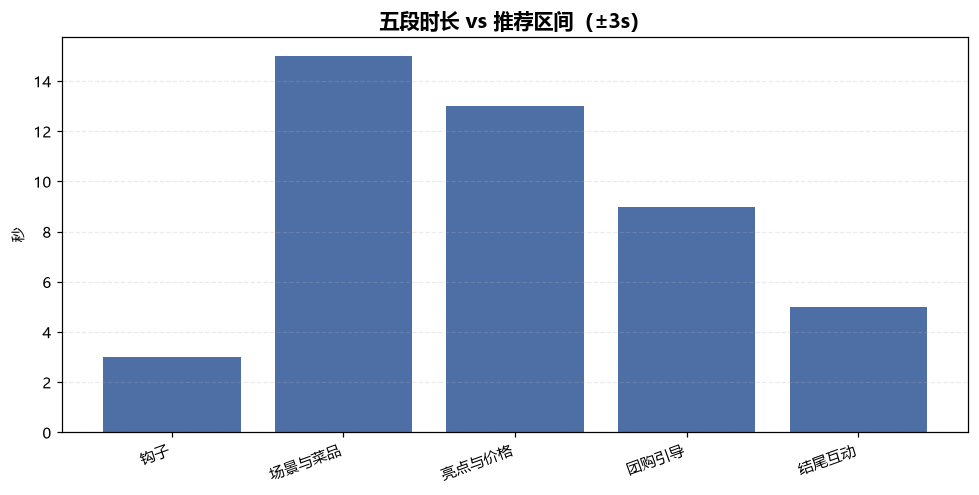
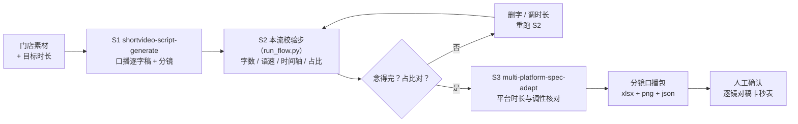

# 口播文案+分镜工作流 Voiceover Storyboard Flow

> 工作流（T3 复合）｜ 属于「探店编导」 ｜ 本地生活商家客群 ｜ 人工触发（随探店脚本工作流联动）
>
> **产出逐字稿级的口播分镜包：每句台词挂在哪个镜头、念多少秒、字数是否念得完，全部对上号——不估「大概 5 秒念完」。**
> DAG 节点 = shortvideo-script-generate → 本流校验步 → multi-platform-spec-adapt · 四道量化检查（字数实数/语速/时间轴/五段占比）· 语速 >6.0 字/秒 🔴 念不完 · 60s 基准占比 3/22/20/10/5s


🎬 **[▶ 观看演示视频（在线播放）](https://cdn.jsdelivr.net/gh/bangwozuo/local-content-zh@main/workflows/voiceover-storyboard-flow/docs/assets/demo.mp4) · [GitHub 页](https://github.com/bangwozuo/local-content-zh/blob/main/workflows/voiceover-storyboard-flow/docs/assets/demo.mp4)** — 四幕检测叙事：业务钩子 → 真实执行 → 检查项逐条亮灯 → 交付物

*上图来自真实执行（`python scripts/run_flow.py --demo`）：45s 面包店样例 5 段合计 45s，抓出 2 个台词问题——钩子 18 字 >15 字上限（🔴）、团购引导 2.22 字/秒过稀（🟡），结论「需微调」。*



*实跑产物：`out/分镜时长分布.png` 五段时长分布图；另有 `out/分镜口播校验表.xlsx`（逐镜校验/五段占比/平台核对三 sheet）与 `out/voiceover_flow.json`。*

---

## 流程 DAG（节点均为本仓真实技能）



## 四道量化检查（S2，数值以脚本输出为准，模型不口算）

| 检查 | 口径 | 判定线 |
|---|---|---|
| ① 台词字数实数 | 按汉字与数字串计数，标点空格不计 | 钩子 >15 字或 >3s → 🔴（完播率红线） |
| ② 语速判定 | 字数 ÷ 时长 | >6.0 字/秒 🔴 念不完（给删字数）；钩子/引导/互动三段 <2.5 字/秒 🟡 台词过稀；场景/亮点段 <4.0 为 B-roll 留白，**正常不报** |
| ③ 时间轴连续性 | 逐段累加无重叠无空洞 | 合计 = 目标 ±2s |
| ④ 五段占比 | 60s 基准 3/22/20/10/5s 按目标等比缩放 | 偏差 ±3s 内合格；结尾互动 <4s 提示（提问要留反应时间） |

## 真实输入 → 真实输出

**输入**（`examples/input.json`）：巷口面包研究所 / 45s / 5 段逐字稿（seg/dur_s/line）。

**输出**（逐镜校验节选，脚本实跑值，完整见 [`examples/output.md`](examples/output.md)）：

| 段落 | 时间轴 | 字数 | 语速 | 判定 | 说明 |
|---|---|---|---|---|---|
| 钩子 | 0-3s | 18 | 6.0 | 🔴 | 钩子 18 字 > 15 字，3 秒念不完 |
| 场景与菜品 | 3-18s | 43 | 2.87 | ✅ | B-roll 留白正常 |
| 团购引导 | 31-40s | 20 | 2.22 | 🟡 | 该段必须持续口播，画面会掉信息 |

**整改给的是可执行数字**：「删『准时』与『只能』，改『14 点出炉的碱水包，去晚就没』（12 字）」；「引导段 9s 应念约 27 字，补『周日到周四都能用』（+8 字）」。

## 假阳性防线（本流特有）

- **留白误报**：探店视频靠 B-roll 撑节奏，全片按 5 字/秒算会误杀一半段落——只钩子/引导/互动三段卡下限
- **数字念法**：「176」按 3 字符计但实念 5 个音节——含大数字的段落人工对稿额外留 1-2s
- **标点吞字**：逐字稿的语气词实拍会即兴增加，人工对稿预留 5% 余量

## 快速开始

```bash
# 演示模式（内置真实样例）
python scripts/run_flow.py --demo
# 指定输入
python scripts/run_flow.py --input examples/input.json --outdir out
```

提示词方式：复制 `prompt.txt` 到任意 AI 工具，按 DAG 顺序执行（S2 未通过不进 S3）。

## 面向谁 / 什么时候用

| ✅ 该用 | ❌ 别用 |
|---|---|
| 脚本转逐字稿，怕实拍「念不完/念太赶」 | 编造台词与时长（信息不足列清单索要） |
| 拍摄前拿到逐镜头的字数/秒数预算表 | 跳过人工逐镜对稿（念一遍卡秒表核对） |
| 引导段挂「探店合作」标注位核对 | 用极限词写台词 |

## 边界与合规

- 输出标注 **AI 生成内容**；成片按平台规则完成 AI 标识
- 引导段涉及合作的台词须含「探店合作」标注位
- 本工作流止于分镜口播包，不代发布；人工逐镜对稿为终闸

## 文件地图

```text
├── README.md               ← 本文件
├── SKILL.md                ← 资产定义（DAG / 契约 / 边界）
├── prompt.txt              ← 编排提示词（四道检查明细 + 失败处理）
├── schema.json             ← 输入输出契约（机器可读）
├── scripts/run_flow.py     ← 确定性校验脚本（字数/语速/时间轴 → xlsx/png/json）
├── examples/               ← 真实输入 + 脚本实跑输出
├── docs/                   ← 9 项配套文档（架构 / 流程 / 场景 / 测试报告…）
└── out/                    ← 实跑产物（分镜口播校验表.xlsx / 分镜时长分布.png / JSON）
```

---

*本资产遵循 [bangwozuo 数字员工资产规范](https://github.com/bangwozuo/digital-employee-spec) v3.0 ｜ [所属员工：探店编导](../../) ｜ [总入口](https://github.com/bangwozuo/digital-employees-hub-zh)*
