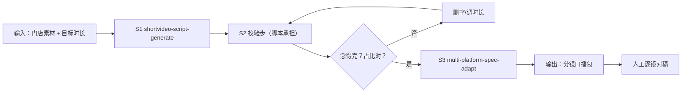

# 口播文案 + 分镜

产出逐字稿级口播分镜包：每句台词挂哪个镜头、念几秒、字数念不念得完，全部对上号。

## 元信息

| 字段 | 值 |
|------|-----|
| ID | `de_local_01_wf03` |
| 类型 | **`composite`（复合技能）** |
| 所属员工 | 探店编导 |
| 阶段 | `P0` |
| 复杂度 | `M` |
| 触发方式 | 手动（脚本定稿后） |
| ROI | 拍前对稿替代拍后补录：省一次补录 ≈ 2 小时 |
| 资产形态 | 提示词编排 + 可选 Python 编排脚本 |

## 能力描述

1. **S1 逐字稿与分镜**：五段式（钩子/场景/亮点/引导/互动），每段台词挂镜头六字段
2. **S2 确定性校验**：台词字数实数（标点不计）；语速 >6.0 字/秒 🔴 念不完、
   口播必需段（钩子/引导/互动）<2.5 字/秒 🟡 过稀、场景亮点段 B-roll 留白合法；
   时间轴连续无重叠；五段占比按目标时长等比缩放（60s 基准 3/22/20/10/5s）±3s
3. **S3 平台核对**：抖音 ≤60s / 小红书 ≤4min / 视频号 ≤60s / B 站 ≤5min，超限给二选一方案
4. **产物**：校验表 Excel（三 sheet）+ 时长分布 PNG + JSON

## 编排的原子技能

| # | 原子技能 | 能力 |
|---|---------|------|
| 1 | [短视频脚本生成](../../skills/shortvideo-script-generate/) | 五段逐字稿、分镜六字段 |
| 2 | [多平台规格适配](../../skills/multi-platform-spec-adapt/) | 平台时长与调性核对 |

## 步骤链路（DAG）



## 步骤明细

| # | 步骤 | 技能资产 | 输入 | 输出 | 失败处理 |
|---|------|---------|------|------|---------|
| 1 | 逐字稿+分镜 | `shortvideo-script-generate` | 门店素材 | segments（seg/dur_s/line） | 挂不到画面的台词删；纯画面段 line 留空标 B-roll |
| 2 | 字数语速校验 | 本流脚本 | segments + 目标时长 | 逐段判定 + 问题清单 | segments 为空中止；段落名非法标注归段；钩子超标 🔴 优先改 |
| 3 | 平台核对 | `multi-platform-spec-adapt` | 成片时长 + 平台 | 上限核对 | 未知平台标「待核对官方」 |
| 4 | 人工对稿 | （人工） | 校验表 | 定稿 | 念一遍卡秒表逐行核对；数字段留 1-2s；即兴余量 5% |

## 输入规格

| 字段 | 类型 | 必填 | 说明 |
|------|------|------|------|
| `store_name` | string | ✅ | 门店名 |
| `target_duration_s` | number | ✅ | 目标时长（45/60 常用） |
| `segments` | array | ✅ | 逐段口播稿：seg（五段之一）/ dur_s / line（台词原文，B-roll 留空） |
| `platforms` | array | ⬜ | 目标平台，默认抖音 |

## 输出规格

| 字段 | 类型 | 说明 |
|------|------|------|
| `verdict` | string | 通过 / 需微调 / 打回重改 |
| `rows` | array | 逐段校验（时间轴/字数/语速/判定） |
| `share` | array | 五段占比 vs 推荐区间 |
| 产物 | file | `out/分镜口播校验表.xlsx`、`out/分镜时长分布.png`、`out/voiceover_flow.json` |

## 错误处理

| 情况 | 处理方式 |
|------|---------|
| segments 为空 | 中止索要逐字稿 |
| 语速 >6.0 字/秒 | 🔴 给删字数（如「需删约 5 字」） |
| 时间轴合计 ≠ 目标 ±2s | 列出超差秒数 |
| 数字念法偏差 | 提示人工对稿时对大数字段落加 1-2s |

## 使用步骤

### 方式一：纯提示词编排（跨平台）

1. 把 `prompt.txt` 全文粘贴为系统提示词
2. 提供逐字稿与目标时长
3. 得到逐镜校验 + 五段占比 + 问题清单
4. 人工逐镜对稿定稿

### 方式二：带脚本（端到端产物）

```bash
python3 <WF_DIR>/scripts/run_flow.py --input input.json --outdir out
python3 <WF_DIR>/scripts/run_flow.py --demo
```

| 平台 | 编排方式 |
|------|---------|
| **Coze / 扣子** | 新建工作流 → S1/S3 节点填对应技能 prompt.txt，S2 用代码节点跑校验脚本 |
| **Dify** | 新建 Workflow → LLM 节点链 + 代码节点 |
| **WorkBuddy** | 新建 Skill 按 prompt.txt 步骤串联 |

## 边界（不做的事）

- ❌ 不编造台词与时长；信息不足列清单索要
- ❌ 不把「念得完」交给感觉，以字数实数为准
- ❌ 钩子段 >3s 或 >15 字不放行
- ❌ 不跳过人工逐镜对稿
- ❌ 不用极限词写台词

## 调用示例

**输入**（`examples/input.json`）：巷口面包研究所 / 45s / 5 段逐字稿。

**输出**（脚本实跑）：合计 45s、五段占比全部达标（等比缩放）、抓出 2 个真问题——
钩子 18 字 > 15 字（🔴）、引导段 2.22 字/秒台词过稀（🟡）→ **需微调**。

## 所属工作流

本资产为复合技能（工作流），是独立的端到端流程，不隶属于其他工作流。

## 合规声明

- 输出标注「AI 生成内容」；成片按平台规则完成 AI 标识
- 引导段合作台词须含「探店合作」标注位
- 对外发布保留人工确认环节

---

*本复合技能遵循 [bangwozuo 数字员工资产规范](https://github.com/bangwozuo/digital-employee-spec) v3.0*
