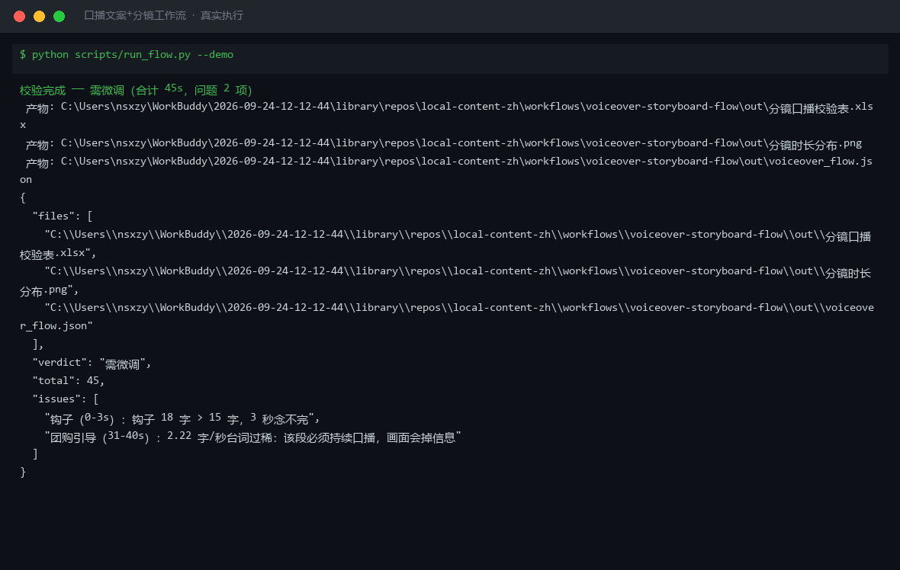

# 截图与录屏

> 以下素材均来自**真实执行**：`--run` 实拍终端 / 实跑产物文件，无摆拍。

## 演示视频


*第二帧为实跑产物图表*

## 执行截图



## 实跑产物

| 文件 | 说明 |
|---|---|
| [`out/voiceover_flow.json`](out/voiceover_flow.json) | 结构化结果（实跑生成） · 3 KB |
| [`out/分镜口播校验表.xlsx`](out/分镜口播校验表.xlsx) | Excel 工作簿（实跑生成） · 8 KB |
| [`out/分镜时长分布.png`](out/分镜时长分布.png) | 图表产物（实跑生成） · 28 KB |


---

## 附录：实跑输出明细

> 本资产为纯提示词客户端资产，无界面可截图。以下为**实跑运行效果**。

## 运行效果

### 输入

```json
{
  "input": {
    "topic": "打卡市中心新开的露营风咖啡馆，手冲咖啡和提拉米苏是招牌",
    "duration": "45 秒",
    "platform": "视频号"
  }
}

```

### 输出

## 执行摘要

基于露营风咖啡馆素材，通过短视频脚本生成技能产出 45 秒口播逐字稿与分镜表，适配视频号调性。

## 分步结果

1. **步骤 1：短视频脚本生成**
   - 输入：topic=打卡市中心新开的露营风咖啡馆，手冲咖啡和提拉米苏是招牌；duration=45 秒；platform=视频号
   - 输出：口播文稿+分镜表+拍摄清单

## 最终交付物

### 45 秒口播逐字稿 + 分镜表

**口播逐字稿**

市中心居然藏了一家露营风咖啡馆。
天幕、折叠椅、煤油灯，城市里的野营感。
招牌手冲，豆子是耶加雪菲，果酸明亮。
提拉米苏 layers 很分明，手指饼干浸得刚刚好。
45 块一杯咖啡+一块蛋糕，坐一下午。
地址我放评论区了，周末去记得预约。

**分镜表**

| # | 时间 | 画面内容 | 景别/运镜 | 口播/字幕 |
|---|---|---|---|---|
| 1 | 0-5s | 咖啡馆外观，天幕与绿植 | 全景/推进 | "市中心居然藏了一家露营风咖啡馆" |
| 2 | 5-12s | 店内全景：天幕、折叠椅、煤油灯 | 中景/横摇 | "天幕、折叠椅、煤油灯，城市里的野营感" |
| 3 | 12-20s | 手冲咖啡过程，水流、滤纸、咖啡液 | 特写/固定 | "招牌手冲，豆子是耶加雪菲，果酸明亮" |
| 4 | 20-30s | 提拉米苏切开，展示 layers | 特写/俯拍 | "提拉米苏 layers 很分明，手指饼干浸得刚刚好" |
| 5 | 30-38s | 咖啡+蛋糕摆桌，窗外城市街景 | 中景/固定 | "45 块一杯咖啡+一块蛋糕，坐一下午" |
| 6 | 38-45s | 老板递名片/预约二维码 | 近景/固定 | "地址我放评论区了，周末去记得预约" |

**拍摄清单**

1. 选择晴天下午 3-4 点拍摄，利用自然光营造露营氛围。
2. 手冲过程需稳定器固定，水流速度保持一致。
3. 提拉米苏提前冷藏，切开后立即拍摄以防塌陷。
4. 视频号不支持左下角挂载，需将地址/预约信息放在评论区并置顶。
5. 背景音乐建议用轻快的民谣或纯音乐，音量低于口播。

> AI 生成内容


---

*运行效果由实跑验证生成*
